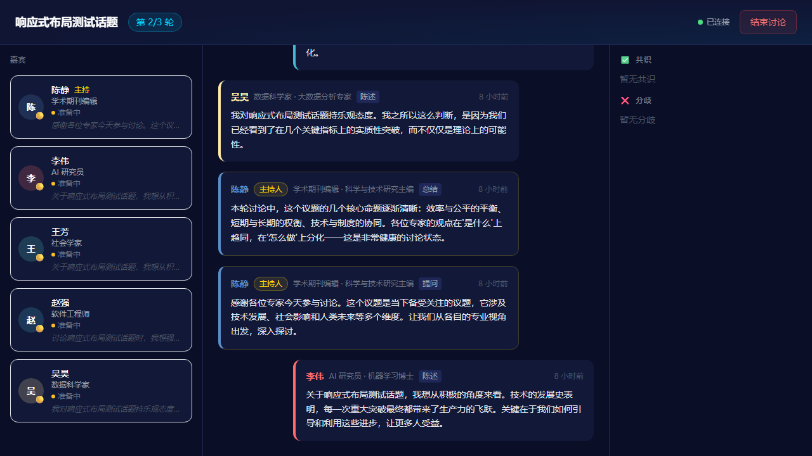

# 🎙️ AI Panel Studio

> AI 驱动的虚拟圆桌讨论平台 — 输入话题，自动生成多元化嘉宾阵容，全自动推进多轮结构化讨论。

[](./LICENSE)
[](https://www.python.org/)
[](https://fastapi.tiangolo.com/)
[](https://react.dev/)
[](https://www.typescriptlang.org/)

<p align="center">
  
</p>

---

## 📖 目录

- [功能特性](#-功能特性)
- [快速开始](#-快速开始)
- [环境变量](#-环境变量)
- [技术选型](#-技术选型)
- [项目结构](#-项目结构)
- [API 概览](#-api-概览)
- [数据库设计](#-数据库设计)
- [测试](#-测试)
- [已完成能力](#-已完成能力)
- [后续改进方向](#-后续改进方向)
- [贡献指南](#-贡献指南)
- [许可证](#-许可证)

---

## ✨ 功能特性

### 已实现 (v0.1.0)

| 功能 | 状态 | 说明 |
|------|------|------|
| 🎯 **智能话题创建** | ✅ | 输入话题 + 设定专家人数 (2-8) + 轮次 (1-10) |
| 🤖 **AI 嘉宾生成** | ✅ | Deepseek 自动生成 1 主持 + N 领域专家，含立场/颜色/头衔 |
| 🎬 **全自动讨论编排** | ✅ | 逐轮推进：主持开场 → 专家发言 → 主持小结，全程零人工干预 |
| 📡 **SSE 实时推送** | ✅ | 发言/状态变更/共识/分歧实时流式推送，15s 心跳保活 |
| 💡 **共识与分歧总结** | ✅ | 讨论结束后 LLM 自动提取共识点与分歧点，标注支持者/对立嘉宾 |
| 📋 **讨论历史** | ✅ | 首页分页列表，支持 pending/active/ended 状态筛选 |
| 🎨 **深色科幻风 UI** | ✅ | 霓虹蓝 + 深空底色，嘉宾专属颜色，完整动画系统 |
| 📱 **响应式布局** | ✅ | 桌面三栏/平板上下/手机手风琴，覆盖 320px-1920px+ |
| 🔧 **Mock 模式** | ✅ | 无 API Key 时自动使用预定义回复，零成本体验全部功能 |
| 🛡️ **安全合规** | ✅ | API Key 仅环境变量、SQL 参数化查询、Pydantic 输入校验 |

---

## 🚀 快速开始

### 前置要求

- **Python** 3.11+
- **Node.js** 18+
- **npm** 9+
- (可选) **Deepseek API Key** — 不提供则自动使用 Mock 模式

### 1. 克隆仓库

```bash
git clone https://github.com/<your-username>/ai-panel-studio.git
cd ai-panel-studio
```

### 2. 启动后端

```bash
cd backend

# 创建虚拟环境
python -m venv venv
source venv/bin/activate    # Windows: venv\Scripts\activate

# 安装依赖
pip install -r requirements.txt

# 配置环境变量 (可选，不配置则使用 Mock 模式)
cp .env.example .env
# 编辑 .env，填入 DEEPSEEK_API_KEY

# 初始化数据库 + 导入样例数据
python ../scripts/init_db.py --seed

# 启动后端开发服务器
uvicorn app.main:app --reload --port 8000
```

后端启动后访问：
- API 文档: http://localhost:8000/docs
- 健康检查: http://localhost:8000/api/health

### 3. 启动前端

```bash
cd frontend

# 安装依赖
npm install

# 启动前端开发服务器
npm run dev
```

前端启动后访问: http://localhost:5173

### 4. 快速体验

1. 打开浏览器访问 `http://localhost:5173`
2. 点击「发起新讨论」
3. 输入话题（如 "AI 会取代人类创造力吗"）
4. 选择专家人数（推荐 3-4 人）
5. 点击「生成阵容」→ 查看 AI 生成的嘉宾
6. 点击「确认并开始」→ 实时观看讨论！

> **提示：** 如果没有 Deepseek API Key，系统自动使用 Mock 模式，可以完整体验所有功能（发言内容为预定义文案）。

---

## 🔧 环境变量

| 变量 | 必填 | 默认值 | 说明 |
|------|------|--------|------|
| `DEEPSEEK_API_KEY` | 否* | `""` | Deepseek API 密钥 |
| `DEEPSEEK_BASE_URL` | 否 | `https://api.deepseek.com` | Deepseek API 地址 |
| `DATABASE_URL` | 否 | `sqlite:///./ai_panel_studio.db` | 数据库连接串 |
| `MOCK_LLM` | 否 | `false` | 强制 Mock 模式 (`true`/`false`) |

> \* 不提供时自动进入 Mock 模式，功能完全可用，Token 零消耗。

**后端 `.env` 文件示例：**
```env
DEEPSEEK_API_KEY=sk-xxxxxxxxxxxxxxxxxxxxxxxx
DEEPSEEK_BASE_URL=https://api.deepseek.com
DATABASE_URL=sqlite:///./ai_panel_studio.db
MOCK_LLM=false
```

**前端环境变量 (`frontend/.env`，可选)：**
```env
VITE_API_BASE_URL=http://localhost:8000
```
默认情况下 Vite 开发服务器通过 proxy 转发 `/api` 请求，无需配置。

---

## 🛠️ 技术选型

### 后端

| 技术 | 用途 |
|------|------|
| **FastAPI** 0.115 | Web 框架，async 原生支持，自动 OpenAPI 文档 |
| **SQLAlchemy** 2.0 | ORM，声明式模型定义，连接池管理 |
| **SQLite** | 数据库，零配置，MVP 友好 |
| **Pydantic** 2.10 | 数据校验与序列化 |
| **sse-starlette** 2.2 | SSE 服务端推送 |
| **httpx** 0.28 | 异步 HTTP 客户端 (调用 Deepseek API) |
| **pytest** + pytest-asyncio | 测试框架 |

### 前端

| 技术 | 用途 |
|------|------|
| **React** 18 | UI 框架，并发渲染 |
| **TypeScript** 5.5 | 类型安全 |
| **Vite** 5 | 构建工具，极速 HMR |
| **Tailwind CSS** 3.4 | 原子化 CSS |
| **Zustand** 4.5 | 轻量状态管理 |
| **React Router** 6.26 | 客户端路由 |

### AI

| 服务 | 模型 | 用途 |
|------|------|------|
| **Deepseek** | `deepseek-chat` (V4 Pro) | 嘉宾生成、发言生成、共识/分歧提取 |

> 详见 [ARCHITECTURE.md](./docs/ARCHITECTURE.md) 了解完整架构设计及技术选型理由。

---

## 📁 项目结构

```
ai-panel-studio/
├── README.md
├── LICENSE
├── CONTRIBUTING.md
│
├── backend/                          # Python 后端
│   ├── app/
│   │   ├── main.py                   # FastAPI 入口
│   │   ├── config.py                 # 环境变量配置
│   │   ├── database.py               # SQLAlchemy 引擎
│   │   ├── models.py                 # ORM 模型 (5 表)
│   │   ├── schemas.py                # Pydantic Schema
│   │   ├── routers/                  # API 路由 (3 模块)
│   │   └── services/                 # 业务逻辑 (9 模块)
│   ├── tests/                        # 测试 (36 单元 + E2E)
│   ├── requirements.txt
│   └── .env.example
│
├── frontend/                         # React 前端
│   ├── src/
│   │   ├── pages/                    # 3 个页面
│   │   ├── components/               # 12 个 UI 组件
│   │   ├── hooks/                    # 自定义 Hooks
│   │   ├── store/                    # Zustand Store
│   │   └── lib/                      # API 客户端
│   └── package.json
│
├── scripts/                          # 工具脚本
│   ├── init_db.py                    # 数据库初始化
│   ├── seed_data.py                  # 样例数据 (7 组)
│   └── quality_check.py              # 质量检查
│
├── docs/                             # 项目文档
│   ├── PRD.md                        # 产品需求
│   ├── ER.md                         # 实体关系
│   ├── API.md                        # API 契约
│   ├── ARCHITECTURE.md               # 系统架构
│   ├── UI_UX_Spec.md                 # UI/UX 规范
│   └── TEST_STRATEGY.md              # 测试策略
│
└── .github/
    └── workflows/
        └── ci.yml                    # CI 流水线
```

---

## 📡 API 概览

### 讨论管理

| 方法 | 路径 | 说明 |
|------|------|------|
| `GET` | `/api/discussions` | 讨论列表 (分页) |
| `POST` | `/api/discussions` | 发起新讨论 |
| `GET` | `/api/discussions/{id}` | 讨论详情 (含嘉宾+发言) |
| `POST` | `/api/discussions/{id}/confirm` | 确认嘉宾，启动讨论 |
| `POST` | `/api/discussions/{id}/end` | 手动结束讨论 |

### 嘉宾生成

| 方法 | 路径 | 说明 |
|------|------|------|
| `POST` | `/api/discussions/{id}/generate-guests` | LLM 生成 1 主持人 + N 专家 |

### 实时事件流

| 方法 | 路径 | 说明 |
|------|------|------|
| `GET` | `/api/discussions/{id}/stream` | SSE 流 (7 种事件类型) |

**SSE 事件：** `speech_added` | `guest_state_changed` | `consensus_updated` | `divergence_updated` | `discussion_ended` | `error` | `ping`

### 共识与分歧

| 方法 | 路径 | 说明 |
|------|------|------|
| `GET` | `/api/discussions/{id}/consensus` | 共识列表 |
| `GET` | `/api/discussions/{id}/divergence` | 分歧列表 |

### 系统

| 方法 | 路径 | 说明 |
|------|------|------|
| `GET` | `/api/health` | 健康检查 |

> 完整 API 文档（含请求/响应示例、错误码）：[docs/API.md](./docs/API.md)
> 在线 Swagger UI：启动后端后访问 `http://localhost:8000/docs`

---

## 🗄️ 数据库设计

```mermaid
erDiagram
    Discussion ||--o{ Guest : has
    Discussion ||--o{ Speech : contains
    Discussion ||--o{ Consensus : produces
    Discussion ||--o{ Divergence : produces
    Guest ||--o{ Speech : makes

    Discussion {
        string id PK "UUID"
        string topic "讨论话题"
        string status "pending|active|ended"
        int expert_count "专家人数"
        string host_id FK "主持人ID"
        int max_rounds "最大轮次"
        int current_round "当前轮次"
        datetime created_at "UTC"
        datetime updated_at "UTC"
    }

    Guest {
        string id PK "UUID"
        string discussion_id FK "CASCADE"
        string name "嘉宾姓名"
        string profession "职业"
        string title "头衔"
        text stance "立场描述"
        string color "HEX颜色"
        string role "host|guest"
        string agent_state "idle|ready|speaking|thinking"
        datetime created_at "UTC"
    }

    Speech {
        string id PK "UUID"
        string discussion_id FK "CASCADE"
        string guest_id FK "SET NULL"
        int round_number "轮次"
        text content "发言内容"
        string speech_type "statement|question|reply|summary"
        datetime timestamp "UTC"
    }

    Consensus {
        string id PK "UUID"
        string discussion_id FK "CASCADE"
        text content "共识内容"
        json supporter_guest_ids "支持的嘉宾ID列表"
        datetime created_at "UTC"
        datetime updated_at "UTC"
    }

    Divergence {
        string id PK "UUID"
        string discussion_id FK "CASCADE"
        text content "分歧描述"
        json opposing_pairs "[[guestA, guestB], ...]"
        datetime created_at "UTC"
        datetime updated_at "UTC"
    }
```



> 详见 [docs/ER.md](./docs/ER.md) 了解完整关系说明、索引设计及级联策略。

---

## 🧪 测试

### 运行测试

```bash
cd backend

# 全部单元测试 (36 个)
pytest tests/ -v

# 单个模块
pytest tests/test_event_bus.py -v

# 覆盖率报告
pytest tests/ --cov=app.services --cov-report=term --cov-report=html

# 覆盖率阈值检查
pytest tests/ --cov=app.services --cov-fail-under=80
```

### 测试覆盖

| 模块 | 测试数 | 覆盖率 | 状态 |
|------|--------|--------|------|
| GuestGenerator | 7 | 91% | ✅ |
| SpeechScheduler | 6 | 81% | ✅ |
| InsightExtractor | 15 | 91% | ✅ |
| EventBus | 8 | 90% | ✅ |
| **合计** | **36** | **≥ 80%** | **全部通过** |

### 测试策略

- **100% Mock LLM**：所有 LLM 调用使用 `AsyncMock`，测试零 Token 消耗，可在离线环境运行
- **内存数据库**：每次测试使用独立的 SQLite `:memory:` 实例（`StaticPool`）
- **TDD 开发**：4 个核心服务模块采用 Red→Green→Refactor 循环开发
- **E2E 测试**：基于 Playwright 的完整用户旅程测试（需单独启动前后端）

> 详见 [docs/TEST_STRATEGY.md](./docs/TEST_STRATEGY.md)

---

## ✅ 已完成能力

### 后端 (10 个端点)

- [x] 讨论 CRUD（创建、列表、详情）
- [x] 嘉宾生成（LLM 驱动，1 主持 + N 专家）
- [x] 讨论确认/结束（状态机：pending → active → ended）
- [x] SSE 实时事件流（7 种事件类型，15s 心跳）
- [x] 共识/分歧查询
- [x] 讨论编排引擎（全自动多轮推进）
- [x] Mock LLM 模式（零配置运行）
- [x] 健康检查端点

### 前端 (3 页面 + 12 组件)

- [x] 首页讨论列表（分页、骨架屏、空状态、错误状态）
- [x] 嘉宾生成页（话题输入、人数滑块、阵容预览、生成动画）
- [x] 演播厅实时讨论（SSE 连接、发言气泡、嘉宾状态窗、共识/分歧面板）
- [x] 响应式布局（桌面三栏 → 平板堆叠 → 手机手风琴）
- [x] 完整动画系统（滑入、淡入、呼吸、脉冲、聚光灯）
- [x] 暗色科幻风视觉设计

### 工程质量

- [x] TypeScript strict mode
- [x] 36 个单元测试，≥ 80% 覆盖率
- [x] 数据库索引设计
- [x] 输入校验 (Pydantic)
- [x] 环境变量管理 (.env.example)
- [x] 7 组高质量样例数据
- [x] 完整项目文档 (7 个 md 文件)

---

## 🔮 后续改进方向

### 短期 (P1 — 下个迭代)

- [ ] **API 路由集成测试**：使用 FastAPI TestClient + 内存数据库覆盖全部端点
- [ ] **前端组件测试**：使用 Vitest + React Testing Library
- [ ] **讨论分享功能**：生成讨论摘要分享链接
- [ ] **讨论导出**：导出为 Markdown/PDF
- [ ] **错误恢复优化**：编排引擎断点续传（中途重启不丢失进度）

### 中期 (P2 — 功能增强)

- [ ] **用户认证系统**：JWT 登录/注册，个人讨论历史
- [ ] **中途插话**：用户在讨论进行中插入问题，引导讨论方向
- [ ] **讨论模板**：提供预设话题模板（科技/社会/经济/文化）
- [ ] **嘉宾自定义**：用户手动编辑/替换 AI 生成的嘉宾
- [ ] **讨论回放**：已结束讨论的逐轮回放（非实时）

### 长期 (P3 — 平台化)

- [ ] **多语言支持**：英文/日文讨论
- [ ] **多 LLM 支持**：接入 OpenAI / Claude / 本地模型
- [ ] **语音合成**：TTS 朗读嘉宾发言
- [ ] **讨论协作**：多人实时围观 + 弹幕评论
- [ ] **数据分析**：讨论热度、嘉宾发言统计、观点倾向性分析
- [ ] **PostgreSQL 迁移**：支撑更高并发

---

## 🤝 贡献指南

欢迎贡献！请阅读 [CONTRIBUTING.md](./CONTRIBUTING.md) 了解：

- 如何提交 Issue
- 如何提交 Pull Request
- 代码规范与 Commit 格式
- 本地开发环境搭建

### 开发工作流

```bash
# 1. Fork 本仓库
# 2. 创建功能分支
git checkout -b feat/your-feature

# 3. 开发 + 测试
cd backend && pytest tests/ -v

# 4. 提交 (遵循 Conventional Commits)
git commit -m "feat: add your feature description"

# 5. 推送并创建 PR
git push origin feat/your-feature
```

---

## 📄 许可证

本项目基于 [MIT License](./LICENSE) 开源。

---

## 🙏 致谢

- [Deepseek](https://www.deepseek.com/) — 提供大语言模型 API
- [FastAPI](https://fastapi.tiangolo.com/) — 卓越的 Python Web 框架
- [Tailwind CSS](https://tailwindcss.com/) — 高效的 CSS 框架
- 所有为本项目做出贡献的开发者

---

<p align="center">
  <b>AI Panel Studio</b> — 让思想碰撞，随时随地。
</p>
