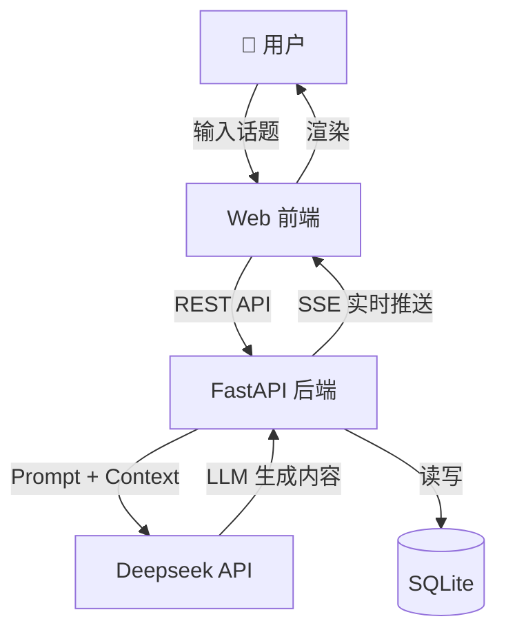
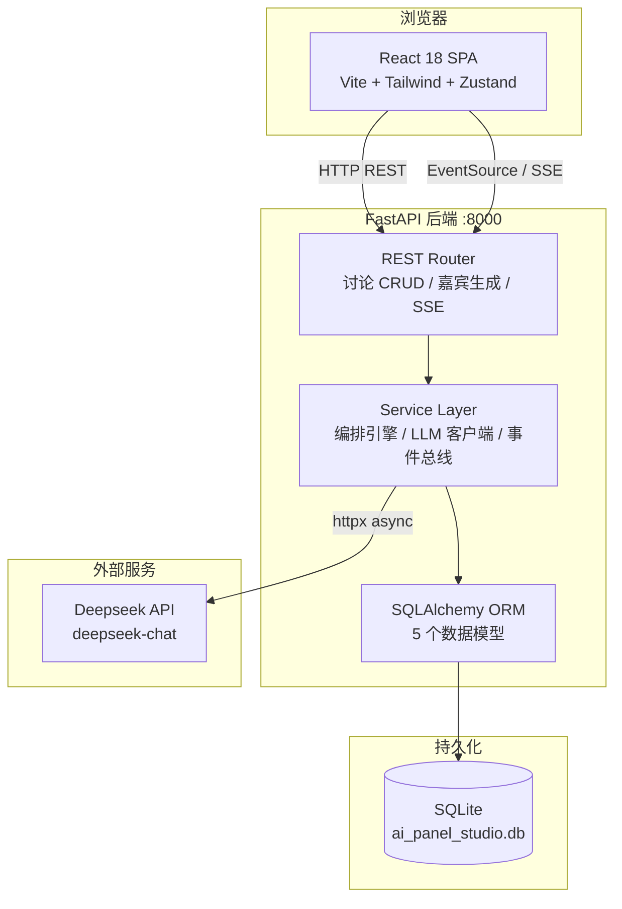
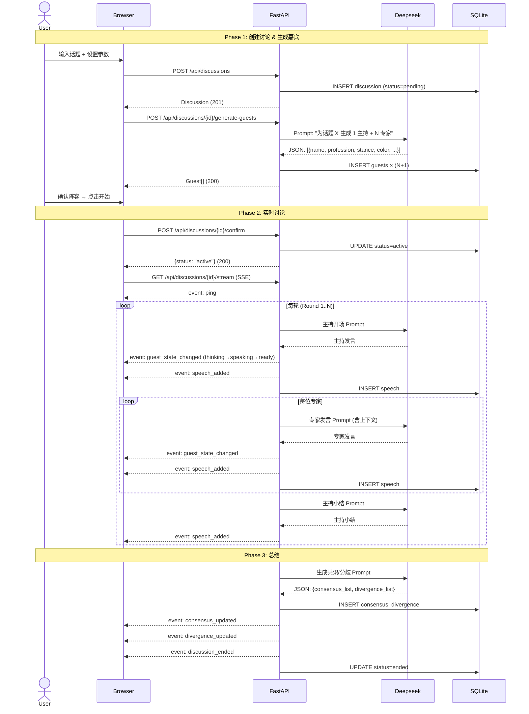
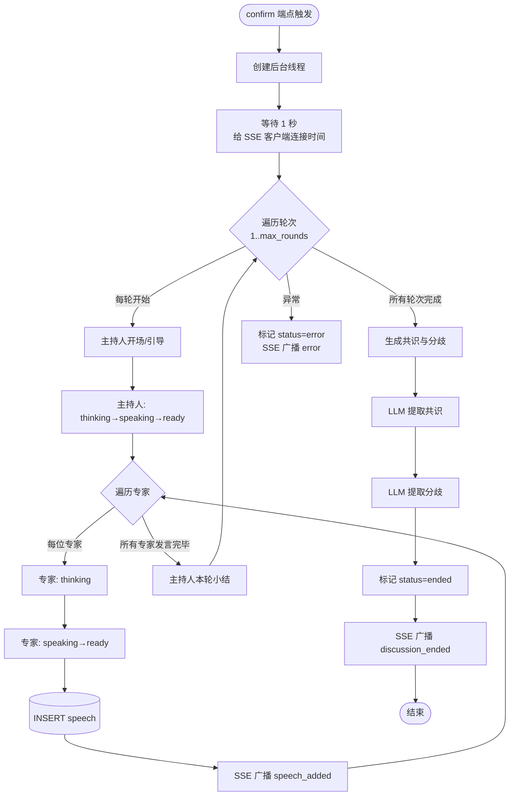
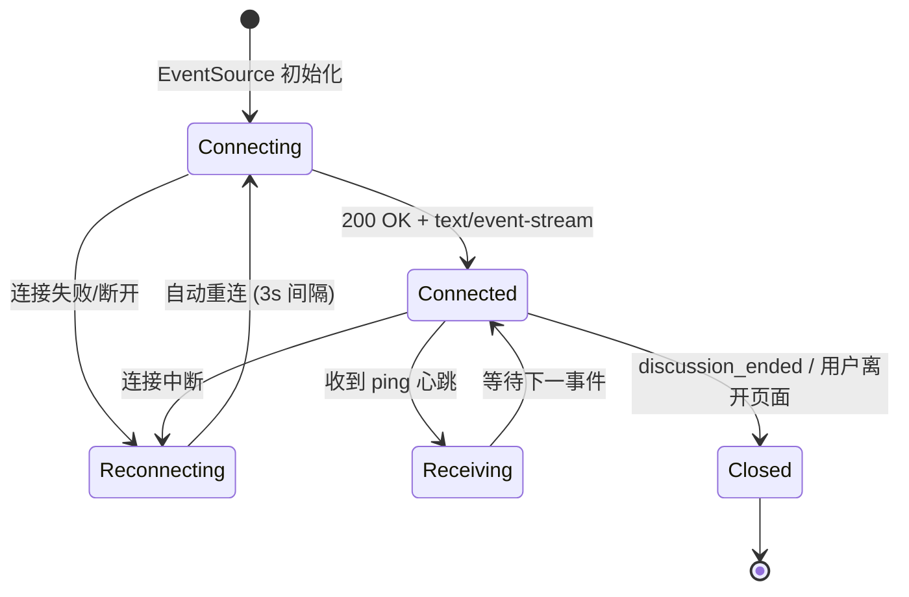
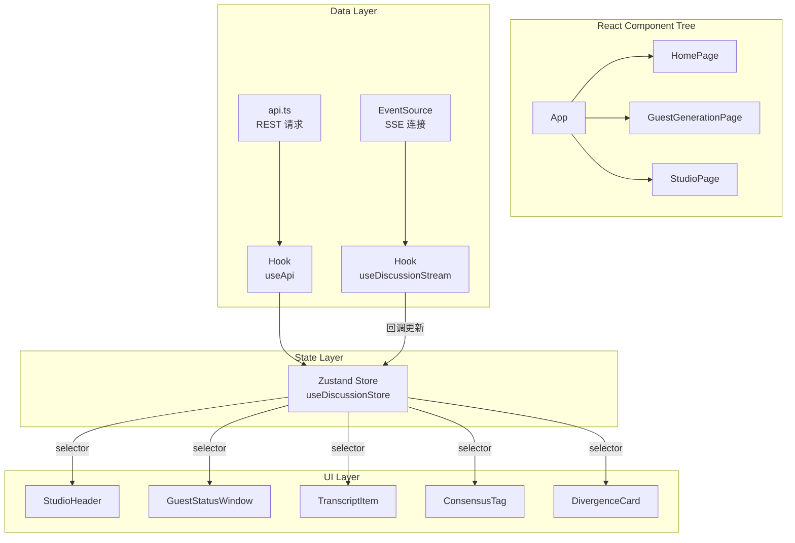
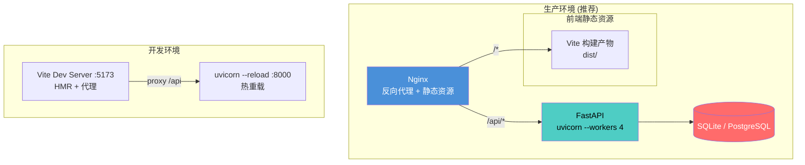

# AI Panel Studio — 系统架构文档

**版本：** v0.1.0 | **日期：** 2026-08-12

---

## 目录

1. [系统概览](#1-系统概览)
2. [技术选型与理由](#2-技术选型与理由)
3. [系统架构图](#3-系统架构图)
4. [项目结构](#4-项目结构)
5. [数据流](#5-数据流)
6. [讨论编排引擎](#6-讨论编排引擎)
7. [SSE 实时通信设计](#7-sse-实时通信设计)
8. [前端状态管理](#8-前端状态管理)
9. [LLM 集成策略](#9-llm-集成策略)
10. [安全设计](#10-安全设计)
11. [部署架构建议](#11-部署架构建议)

---

## 1. 系统概览

**AI Panel Studio** 是一款 AI 驱动的虚拟圆桌讨论平台。用户输入话题后，系统利用大语言模型自动生成多元化嘉宾阵容，全自动推进多轮结构化讨论，并通过 SSE 实时向用户推送发言内容、嘉宾状态变化及最终的共识/分歧总结。



---

## 2. 技术选型与理由

### 2.1 后端

| 技术 | 版本 | 选型理由 |
|------|------|----------|
| **FastAPI** | 0.115.x | 原生 async 支持、自动 OpenAPI 文档、Pydantic 数据校验、SSE 友好 |
| **SQLAlchemy** | 2.0.x | Python ORM 事实标准、2.0 新式 API、连接池与事务管理 |
| **SQLite** | 3.x | 零配置、文件级部署、MVP 阶段无需运维数据库服务器 |
| **sse-starlette** | 2.2.x | FastAPI 生态的 SSE 实现，支持 async generator |
| **httpx** | 0.28.x | 全 async HTTP 客户端，用于调用 Deepseek API |
| **Pydantic** | 2.10.x | 数据校验与序列化，与 FastAPI 深度集成 |

### 2.2 前端

| 技术 | 版本 | 选型理由 |
|------|------|----------|
| **React** | 18.x | 生态成熟、社区活跃、并发特性 |
| **TypeScript** | 5.5.x | 类型安全、开发体验好、降低运行时错误 |
| **Vite** | 5.x | 极快的 HMR、原生 ESM、开箱即用 |
| **Tailwind CSS** | 3.4.x | 原子化 CSS、设计系统约束、零运行时 |
| **Zustand** | 4.5.x | 轻量状态管理、无 boilerplate、支持 store factory |
| **React Router** | 6.26.x | 声明式路由、嵌套路由、URL 参数管理 |

### 2.3 AI

| 技术 | 说明 |
|------|------|
| **Deepseek V4 Pro** (`deepseek-chat`) | 性价比优秀的中文 LLM，支持长上下文，JSON 格式输出稳定 |

---

## 3. 系统架构图



---

## 4. 项目结构

```
ai-panel-studio/
├── README.md                     # 项目总览与快速开始
├── LICENSE                       # MIT 许可证
├── CONTRIBUTING.md               # 贡献指南
│
├── backend/                      # Python 后端
│   ├── app/
│   │   ├── main.py               # FastAPI 入口，CORS、路由注册、生命周期
│   │   ├── config.py             # 环境变量配置 (pydantic-settings)
│   │   ├── database.py           # SQLAlchemy 引擎、Session、init_db
│   │   ├── models.py             # ORM 模型 (5 表)
│   │   ├── schemas.py            # Pydantic 请求/响应 Schema
│   │   ├── routers/
│   │   │   ├── discussions.py    # 讨论 CRUD + 确认/结束
│   │   │   ├── guests.py         # 嘉宾生成 (调用 LLM)
│   │   │   └── events.py         # SSE 流 + 共识/分歧查询
│   │   └── services/
│   │       ├── llm_client.py              # Deepseek API 封装
│   │       ├── mock_llm_responses.py      # Mock 模式 (免 API Key 运行)
│   │       ├── orchestration_service.py   # 讨论编排引擎 (核心)
│   │       ├── discussion_service.py      # 讨论业务逻辑
│   │       ├── guest_service.py           # 嘉宾业务逻辑
│   │       ├── guest_generator.py         # 嘉宾生成器 (TDD)
│   │       ├── speech_scheduler.py        # 发言调度器 (TDD)
│   │       ├── insight_extractor.py       # 共识/分歧提取 (TDD)
│   │       └── event_bus.py              # 事件总线 (TDD)
│   ├── tests/
│   │   ├── conftest.py                    # Fixtures: mock LLM + in-memory DB
│   │   ├── test_event_bus.py
│   │   ├── test_guest_generator.py
│   │   ├── test_insight_extractor.py
│   │   ├── test_speech_scheduler.py
│   │   └── e2e/
│   │       ├── test_full_journey.py       # 完整用户旅程
│   │       ├── test_parallel_isolation.py # 并发隔离
│   │       └── test_responsive.py         # 响应式布局
│   ├── requirements.txt
│   ├── pytest.ini
│   └── .env.example
│
├── frontend/                     # React 前端
│   ├── src/
│   │   ├── main.tsx              # 入口
│   │   ├── App.tsx               # 路由定义
│   │   ├── pages/
│   │   │   ├── HomePage.tsx            # 首页 (讨论列表)
│   │   │   ├── GuestGenerationPage.tsx # 嘉宾生成页
│   │   │   └── StudioPage.tsx          # 演播厅 (实时讨论)
│   │   ├── components/           # 可复用 UI 组件 (12 个)
│   │   ├── hooks/                # 自定义 Hooks (useApi, useDiscussionStream)
│   │   ├── store/                # Zustand Store (useDiscussionStore)
│   │   ├── lib/                  # API 客户端 + 常量
│   │   └── types/                # TypeScript 类型定义
│   ├── index.html
│   ├── vite.config.ts
│   ├── tailwind.config.ts
│   └── package.json
│
├── scripts/                      # 工具脚本
│   ├── init_db.py                # 数据库初始化
│   ├── seed_data.py              # 样例数据 (7 组预设讨论)
│   └── quality_check.py          # 质量检查 (5 项)
│
├── docs/                         # 项目文档
│   ├── PRD.md                    # 产品需求文档
│   ├── ER.md                     # 实体关系文档
│   ├── API.md                    # API 契约文档
│   ├── UI_UX_Spec.md             # UI/UX 视觉规范
│   ├── ARCHITECTURE.md           # 系统架构文档 (本文件)
│   ├── TEST_STRATEGY.md          # 测试策略文档
│   ├── BUG_REPORTS.md            # Bug 报告
│   └── E2E_REPORT.md             # E2E 测试报告
│
└── .github/
    └── workflows/
        └── ci.yml                # CI/CD 流水线
```

---

## 5. 数据流



---

## 6. 讨论编排引擎

编排引擎 (`orchestration_service.py`) 是整个系统的心脏，在后台线程中运行：



**编排策略关键点：**

1. **串行推进**：每轮中主持人和嘉宾按固定顺序依次发言，确保讨论逻辑清晰
2. **上下文传递**：每位发言者携带完整的讨论上下文（最近 20 条消息）
3. **状态机驱动**：嘉宾状态在 idle → ready → thinking → speaking 之间转换
4. **事件广播**：每次状态变更和发言生成后立即通过 SSE 广播
5. **容错设计**：编排异常时标记讨论为 error 状态并广播错误事件

---

## 7. SSE 实时通信设计

### 7.1 事件类型

| 事件名 | 触发时机 | 数据载荷 |
|--------|----------|----------|
| `ping` | 每 15 秒心跳 | `{}` |
| `speech_added` | 新发言生成 | `{speech, round_number}` |
| `guest_state_changed` | 嘉宾状态变化 | `{guest_id, agent_state}` |
| `consensus_updated` | 共识被创建 | `{consensus}` |
| `divergence_updated` | 分歧被创建 | `{divergence}` |
| `discussion_ended` | 讨论结束 | `{discussion_id, final_consensus[], final_divergence[]}` |
| `error` | 编排错误 | `{code, message}` |

### 7.2 连接生命周期



---

## 8. 前端状态管理

采用 **Zustand Store Factory** 模式——每个讨论拥有独立的 Store 实例，避免状态污染：



**Store 结构：**
```typescript
interface DiscussionState {
  // 数据
  discussion: DiscussionDetail | null;
  speeches: Speech[];
  consensusList: Consensus[];
  divergenceList: Divergence[];
  guestStates: Record<string, GuestState>;

  // 连接状态
  sseConnected: boolean;
  loading: boolean;
  error: string | null;

  // 操作
  setDiscussion: (d: DiscussionDetail) => void;
  addSpeech: (s: Speech) => void;
  updateGuestState: (id: string, state: string) => void;
  addConsensus: (c: Consensus) => void;
  addDivergence: (d: Divergence) => void;
  setDiscussionEnded: () => void;
  setError: (e: string) => void;
}
```

---

## 9. LLM 集成策略

### 9.1 双模式运行

| 模式 | 触发条件 | 行为 |
|------|----------|------|
| **真实模式** | `DEEPSEEK_API_KEY` 已设置 + `MOCK_LLM != "true"` | 调用 Deepseek API |
| **Mock 模式** | `DEEPSEEK_API_KEY` 为空 或 `MOCK_LLM="true"` | 返回预定义中文回复，零 Token 消耗 |

### 9.2 Prompt 设计

- **嘉宾生成**：System prompt 定义输出格式（JSON），User prompt 传入话题 + 人数
- **发言生成**：System prompt 设定发言人设（姓名、角色、立场），Context 传入讨论上下文
- **共识/分歧**：User prompt 要求输出结构化 JSON，包含共识点和分歧点

### 9.3 容错

- LLM 调用超时：120 秒
- JSON 解析失败：自动清洗 markdown 代码块标记
- 解析仍失败：返回空结果，讨论标记为 ended（不阻塞流程）

---

## 10. 安全设计

| 层面 | 措施 |
|------|------|
| **API Key** | 仅通过环境变量 `DEEPSEEK_API_KEY` 读取，`.env` 已加入 `.gitignore` |
| **CORS** | MVP 阶段 `allow_origins=["*"]`，生产需收紧 |
| **SQL 注入** | SQLAlchemy ORM 参数化查询，无原始 SQL 拼接 |
| **输入校验** | Pydantic 模型严格校验 (topic 长度、expert_count 范围) |
| **前端构建** | 质量检查脚本扫描 dist 产物，确保无 API Key 泄露 |
| **认证** | MVP 阶段不做认证（所有讨论公开可见），P2 规划用户系统 |

---

## 11. 部署架构建议



**生产部署 checklist：**
- [ ] 设置 `DEEPSEEK_API_KEY` 环境变量（非 .env 文件）
- [ ] 收紧 CORS 为具体域名
- [ ] 配置 Nginx proxy_buffering off（SSE 兼容）
- [ ] 如并发量大，考虑迁移到 PostgreSQL
- [ ] 配置 systemd supervisor 或 Docker 容器化
- [ ] 设置日志聚合与监控告警

---

> **下一步：** 阅读 [PRD.md](./PRD.md) 了解产品需求，阅读 [API.md](./API.md) 了解接口契约。
