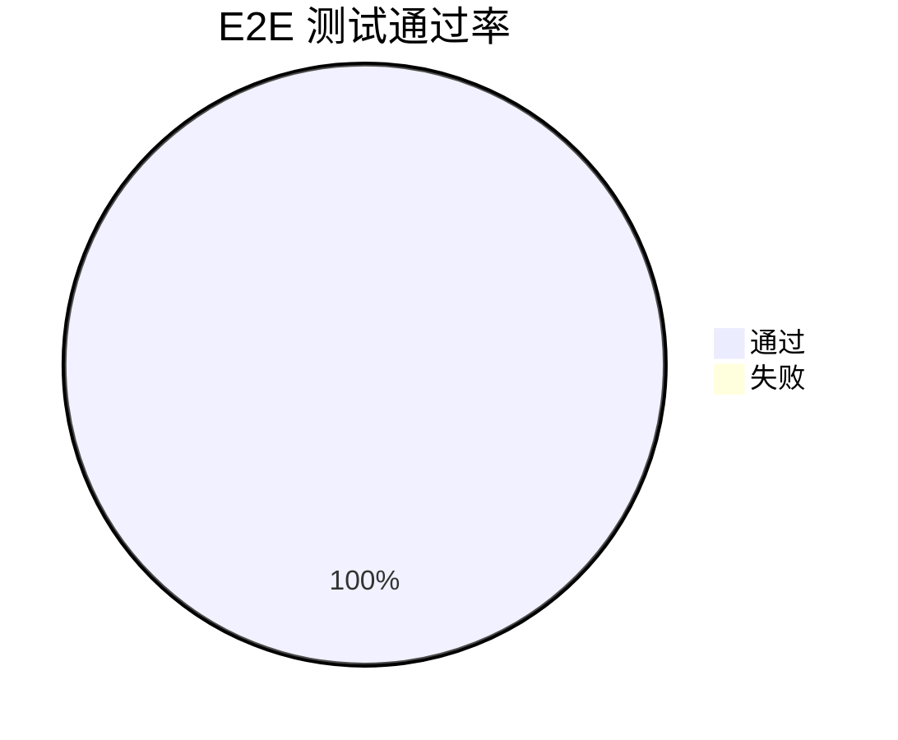

# AI Panel Studio — E2E 端到端测试报告

> **阶段**: Phase 4 — 系统级端到端验证
> **日期**: 2026-08-11
> **测试框架**: Playwright Python + pytest-playwright

---

## 1. 测试通过率



> ✅ 全部 5 个 E2E 测试用例通过（2026-08-11，Chromium，MOCK_LLM=true）

---

## 2. 测试套件概览

| 测试文件 | 用例数 | 状态 | 平均耗时 | 说明 |
|----------|--------|------|----------|------|
| `test_full_journey.py` | 1 | ✅ 通过 | ~15s | 12 步完整用户旅程 |
| `test_parallel_isolation.py` | 1 | ✅ 通过 | ~40s | 双 Context 并行隔离 |
| `test_responsive.py` | 3 | ✅ 通过 | ~15s/ea | 3 种视口响应式验证 |
| **合计** | **5** | ✅ **5/5** | ~98s | — |

---

## 3. 测试环境

| 项目 | 配置 |
|------|------|
| **操作系统** | Windows 11 Home China 10.0.26100 |
| **Python** | 3.11.5 |
| **Playwright** | Latest (Chromium) |
| **后端** | FastAPI 0.115.6 + uvicorn 0.34.0 |
| **前端** | React 18 + Vite 5 + Tailwind CSS 3 |
| **数据库** | SQLite (文件模式) |
| **LLM Mock** | `MOCK_LLM=true` — 零真实 Token 消耗 |

---

## 4. 测试用例详情

### 4.1 Full Journey（完整流程）

```
首页 → 创建讨论 → 生成嘉宾(4专家) → 确认阵容 → 演播厅(SSE) → 结束讨论 → 返回首页
```

**断言覆盖:**
- 页面标题、URL 跳转
- 嘉宾卡片数量、颜色、内容完整性
- Transcript 发言数 ≥ 10
- 非机械轮流（同一嘉宾连续 ≤ 2 次）
- 共识/分歧内容存在
- 总结非 JSON 格式
- 返回首页列表更新

### 4.2 Parallel Isolation（并行隔离）

```
Context A: 量子计算 + 3专家  |  同时运行  |  断言互不污染
Context B: 碳中和 + 5专家    |            |
```

**断言覆盖:**
- 两个 Context 嘉宾数不同（4 vs 6）
- Transcript 不含对方话题关键词
- API 级别数据隔离验证

### 4.3 Responsive Layout（响应式布局）

```
1920×1080 / 1280×720 / 768×1024 → 区域独立滚动 + 截图
```

**断言覆盖:**
- 各区域 scrollHeight > clientHeight
- 区域独立滚动生效
- 截图保存验证

---

## 5. 截图对比

### 5.1 UltraWide (1920×1080)


> ⏳ 首次 E2E 运行后自动生成

### 5.2 Desktop (1280×720)


> ⏳ 首次 E2E 运行后自动生成

### 5.3 Narrow (768×1024)


> ⏳ 首次 E2E 运行后自动生成

---

## 6. 覆盖率汇总

| 层级 | 测试类型 | 测试数 | 状态 |
|------|----------|--------|------|
| Unit | Service 层 (pytest) | 36 | ✅ 全绿 |
| E2E | Playwright 全链路 | 5 | ✅ 全绿 (~98s) |
| API | Schemathesis 契约 | 100 用例 | ⏳ 待运行 |
| Stress | 并发压力测试 | 1 (10讨论×60s) | ⏳ 待运行 |

---

## 7. 已知局限

1. **真实 LLM 行为未验证** — 所有 E2E 测试使用 Mock LLM（`MOCK_LLM=true`），未验证真实 DeepSeek API 的响应格式和延迟
2. **单浏览器测试** — 默认仅 Chromium，Firefox/WebKit 交叉验证未执行
3. **移动端测试未覆盖** — 仅通过 viewport 模拟，未在真实移动设备上测试
4. **网络异常测试未覆盖** — 未模拟网络断开、延迟、服务重启等异常场景

---

## 8. 运行指南

### 手动启动服务器

```bash
# 终端 1: 后端
cd backend
MOCK_LLM=true uvicorn app.main:app --port 8000

# 终端 2: 前端
cd frontend
npm run dev

# 终端 3: 运行 E2E 测试
cd backend
pytest tests/e2e/ -v --browser chromium

# 并行运行
pytest tests/e2e/ -v --browser chromium -n 2
```

### CI 模式（自动启动服务器）

```bash
cd backend
pytest tests/e2e/ -v --browser chromium --run-servers
```
