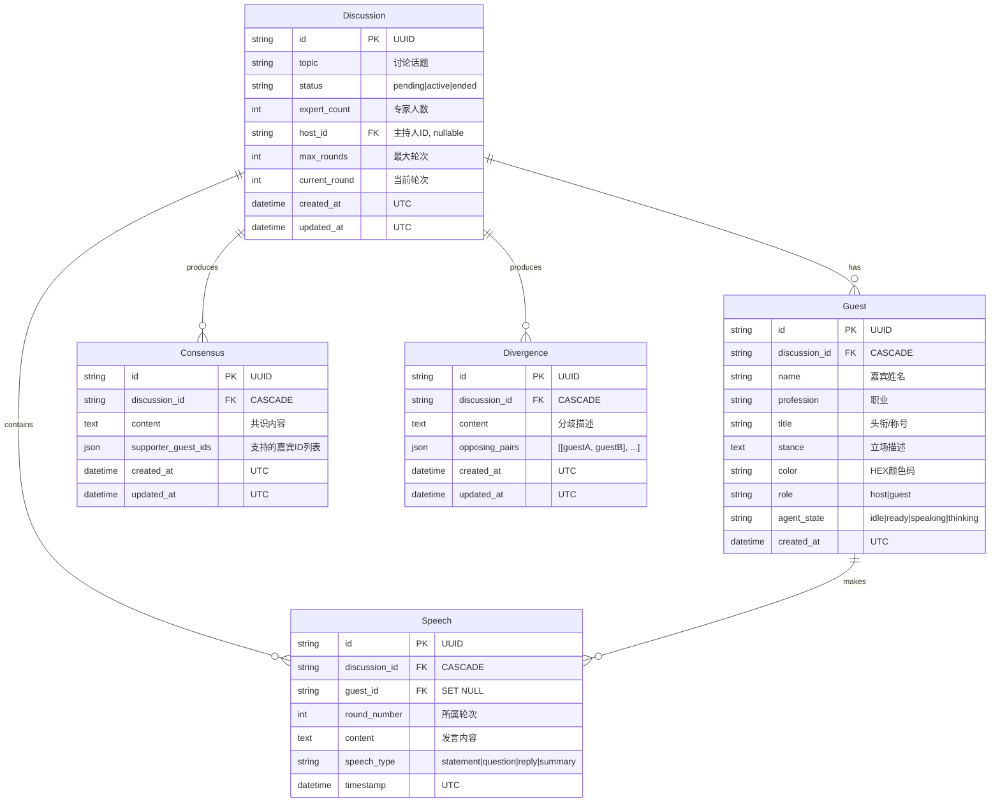

# AI Panel Studio — 实体关系文档 (ER)

## 实体关系图

## 关系说明

| 关系 | 类型 | 级联 |
|------|------|------|
| Discussion → Guest | 1:N | CASCADE 删除 |
| Discussion → Speech | 1:N | CASCADE 删除 |
| Discussion → Consensus | 1:N | CASCADE 删除 |
| Discussion → Divergence | 1:N | CASCADE 删除 |
| Guest → Speech | 1:N | SET NULL（嘉宾删除后发言保留但匿名） |

## 索引设计

| 表 | 索引 | 用途 |
|----|------|------|
| discussions | `status` | 按状态筛选 |
| discussions | `created_at` | 按时间排序 |
| guests | `discussion_id` | 查询讨论下的嘉宾 |
| guests | `role` | 区分主持人/专家 |
| speeches | `discussion_id` | 查询讨论下的发言 |
| speeches | `guest_id` | 查询嘉宾的发言 |
| speeches | `(discussion_id, round_number)` | 按轮次查询发言 |
| consensus | `discussion_id` | 查询讨论下的共识 |
| divergence | `discussion_id` | 查询讨论下的分歧 |
