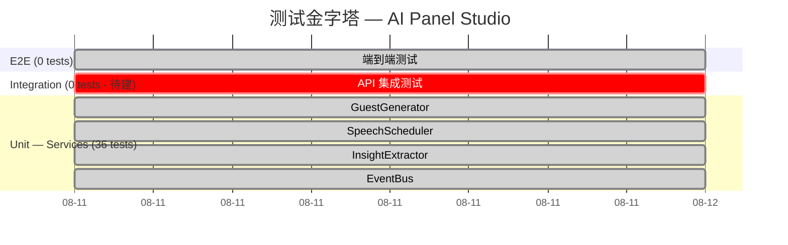

# AI Panel Studio — 测试策略文档

> **项目**: AI 圆桌讨论 Web 应用
> **测试阶段**: Phase 3 — TDD 服务层重构
> **日期**: 2026-08-11

---

## 1. 测试金字塔



| 层级 | 数量 | 状态 | 说明 |
|------|------|------|------|
| **单元测试 (Service)** | 36 | ✅ 全绿 | 4 个核心服务模块，LLM 调用 100% Mock |
| **单元测试 (API)** | 0 | ⬜ 待建 | FastAPI 路由处理器测试 |
| **集成测试** | 0 | ⬜ 待建 | 完整请求-响应流程 |
| **E2E 测试** | 0 | ⬜ 待建 | 浏览器端到端测试 |

---

## 2. 测试用例矩阵

### 2.1 GuestGenerator (`guest_generator.py`) — 覆盖率 91%

| # | 测试 | 类型 | Mock 策略 | 状态 |
|---|------|------|-----------|------|
| 1 | `test_generate_guests_creates_host_first` | 功能 | `mock_llm_client.generate_guests` 返回预定义数据 | ✅ |
| 2 | `test_generate_guests_respects_count` | 功能 | `mock_llm_client.generate_guests` 按参数返回 | ✅ |
| 3 | `test_generate_guests_color_unique` | 边界 | Mock 返回空 color，验证 `_assign_colors` 填充 | ✅ |
| 4 | `test_generate_guests_stance_related_to_topic` | 功能 | Mock 返回含关键词的 stance | ✅ |
| 5 | `test_generate_guests_invalid_count_raises` | 异常 | 无需 Mock（同步校验） | ✅ |
| 6 | `test_generate_guests_api_key_missing_raises` | 异常 | `patch.dict` 清空环境变量 | ✅ |
| 7 | `test_generate_retries_on_validation_error` | 异常/重试 | Mock 返回无效数据 + patch `asyncio.sleep` | ✅ |

### 2.2 SpeechScheduler (`speech_scheduler.py`) — 覆盖率 81%

| # | 测试 | 类型 | Mock 策略 | 状态 |
|---|------|------|-----------|------|
| 1 | `test_no_mechanical_rotation` | 算法 | 纯权重计算，无需 Mock LLM | ✅ |
| 2 | `test_host_at_turning_points` | 算法 | 纯权重计算 | ✅ |
| 3 | `test_prefers_silent_guests` | 算法 | 纯权重计算 | ✅ |
| 4 | `test_stance_conflict_boosts_reply` | 算法 | 纯 `_has_stance_conflict` 方法 | ✅ |
| 5 | `test_content_length_constraint` | 功能 | `mock_llm.generate_speech` 返回长文本 | ✅ |
| 6 | `test_agent_state_and_thought_summary` | 功能 | `mock_llm.generate_speech` 返回标准文本 | ✅ |

### 2.3 InsightExtractor (`insight_extractor.py`) — 覆盖率 91%

| # | 测试 | 类型 | Mock 策略 | 状态 |
|---|------|------|-----------|------|
| 1 | `test_jaccard_similarity_threshold` | 算法 | 无需 Mock（纯函数） | ✅ |
| 2 | `test_jaccard_identical_strings` | 边界 | 无需 Mock | ✅ |
| 3 | `test_jaccard_empty_string` | 边界 | 无需 Mock | ✅ |
| 4 | `test_is_duplicate_detection` | 算法 | 无需 Mock | ✅ |
| 5 | `test_should_extract` | 逻辑 | 无需 Mock | ✅ |
| 6 | `test_extract_consensus_from_agreements` | 功能 | `mock_llm.chat_completion` 返回 JSON | ✅ |
| 7 | `test_consensus_deduplication` | 功能 | Mock 返回与已有共识相似的内容 | ✅ |
| 8 | `test_incremental_update_not_overwrite` | 功能 | Mock 分 2 次返回不同共识 | ✅ |
| 9 | `test_extract_divergence_from_opposing` | 功能 | Mock 返回分歧 JSON | ✅ |
| 10 | `test_extract_empty_on_short_transcript` | 边界 | 无需 Mock（短发言直接返回空） | ✅ |
| 11 | `test_parse_json_embedded_in_text` | 容错 | Mock 返回文本+JSON 混合 | ✅ |
| 12 | `test_parse_completely_invalid_json` | 容错 | Mock 返回纯文本 | ✅ |
| 13 | `test_parse_single_object_not_array` | 容错 | Mock 返回单个 JSON 对象 | ✅ |
| 14 | `test_divergence_json_embedded_in_text` | 容错 | Mock 返回嵌入文本的分歧 JSON | ✅ |
| 15 | `test_skip_items_with_empty_content` | 边界 | Mock 返回含空 content 的数组 | ✅ |

### 2.4 EventBus (`event_bus.py`) — 覆盖率 90%

| # | 测试 | 类型 | Mock 策略 | 状态 |
|---|------|------|-----------|------|
| 1 | `test_event_format_correct` | 格式 | 无需 Mock | ✅ |
| 2 | `test_discussion_isolation` | 隔离 | 无需 Mock | ✅ |
| 3 | `test_broadcast_reaches_all_subscribers` | 功能 | 无需 Mock | ✅ |
| 4 | `test_unsubscribe_cleans_up` | 功能 | 无需 Mock | ✅ |
| 5 | `test_unsubscribe_nonexistent_safe` | 边界 | 无需 Mock | ✅ |
| 6 | `test_stream_heartbeat` | 功能 | `heartbeat_interval=0.05s` 快速触发 | ✅ |
| 7 | `test_async_generator_yields_events` | 功能 | 广播后立即 `anext` | ✅ |
| 8 | `test_async_generator_multiple_events` | 功能 | 连续广播 3 条 | ✅ |

---

## 3. Mock 策略

### 3.1 核心原则

> **所有 LLM 调用 100% Mock，零真实 Token 消耗。所有测试可在离线环境通过。**

### 3.2 Mock 层级

```
┌──────────────────────────────────────────────┐
│              测试用例                          │
├──────────────────────────────────────────────┤
│  GuestGenerator / SpeechScheduler /           │
│  InsightExtractor / EventBus                  │
│         │                                      │
│         ▼                                      │
│  MagicMock(llm_client)                        │
│  ├── generate_guests  → AsyncMock             │
│  ├── generate_speech  → AsyncMock             │
│  └── chat_completion  → AsyncMock             │
│         │                                      │
│         ▼                                      │
│  return_value = 预定义测试数据                  │
└──────────────────────────────────────────────┘
```

### 3.3 具体策略

| 依赖 | Mock 方式 | 说明 |
|------|-----------|------|
| **LLM API 调用** | `AsyncMock` return_value | 每个测试按需配置返回值 |
| **环境变量** | `@patch.dict(os.environ, ...)` | 注入 `DEEPSEEK_API_KEY`，autouse fixture 统一设置 |
| **asyncio.sleep** | `@patch("asyncio.sleep", AsyncMock())` | 仅重试测试使用，避免真等待 |
| **数据库** | SQLite `:memory:` + `StaticPool` | 隔离、快速、每次测试后销毁重建 |

### 3.4 数据库隔离

```python
@pytest.fixture(scope="function")
def db_session():
    engine = create_engine(
        "sqlite:///:memory:",
        connect_args={"check_same_thread": False},
        poolclass=StaticPool,
    )
    Base.metadata.create_all(bind=engine)
    session = Session(bind=engine)
    yield session
    session.close()
    Base.metadata.drop_all(bind=engine)
```

---

## 4. 测试基础设施

### 4.1 配置文件

```ini
# pytest.ini
[pytest]
asyncio_mode = auto
testpaths = tests
python_files = test_*.py
addopts = -v --tb=short
```

### 4.2 运行命令

```bash
# 全部测试
pytest tests/ -v

# 单模块
pytest tests/test_guest_generator.py -v

# 覆盖率
pytest tests/ --cov=app.services --cov-report=term --cov-report=html

# 仅 4 个 TDD 模块覆盖率
pytest tests/ --cov=app.services.guest_generator \
              --cov=app.services.speech_scheduler \
              --cov=app.services.insight_extractor \
              --cov=app.services.event_bus \
              --cov-report=term
```

### 4.3 依赖

```txt
pytest>=7.0
pytest-asyncio>=0.21
pytest-cov>=4.0
```

---

## 5. CI 集成建议

### 5.1 GitHub Actions 示例

```yaml
name: Backend Tests

on:
  push:
    paths:
      - 'backend/**'
  pull_request:
    paths:
      - 'backend/**'

jobs:
  test:
    runs-on: ubuntu-latest
    defaults:
      run:
        working-directory: backend

    steps:
      - uses: actions/checkout@v4

      - uses: actions/setup-python@v5
        with:
          python-version: '3.11'

      - name: Install dependencies
        run: |
          pip install -r requirements.txt
          pip install pytest pytest-asyncio pytest-cov

      - name: Run tests with coverage
        run: |
          pytest tests/ -v \
            --cov=app.services.guest_generator \
            --cov=app.services.speech_scheduler \
            --cov=app.services.insight_extractor \
            --cov=app.services.event_bus \
            --cov-report=term \
            --cov-report=html \
            --junitxml=junit.xml

      - name: Coverage threshold check
        run: |
          pytest tests/ \
            --cov=app.services.guest_generator \
            --cov=app.services.speech_scheduler \
            --cov=app.services.insight_extractor \
            --cov=app.services.event_bus \
            --cov-fail-under=80

      - name: Upload coverage
        uses: actions/upload-artifact@v4
        with:
          name: coverage-report
          path: backend/htmlcov/
```

### 5.2 Pre-commit Hook

```bash
#!/bin/sh
# .git/hooks/pre-commit
cd backend
python -m pytest tests/ -v --cov-fail-under=80
```

---

## 6. TDD 流程记录

| 阶段 | 模块 | 测试数 | Red→Green | 最终覆盖率 |
|------|------|--------|-----------|-----------|
| Task 1 | GuestGenerator | 7 | ✅ | 91% |
| Task 2 | SpeechScheduler | 6 | ✅ | 81% |
| Task 3 | InsightExtractor | 15 | ✅ | 91% |
| Task 4 | EventBus | 8 | ✅ | 90% |
| **合计** | **4 modules** | **36** | **全部通过** | **≥ 80%** |

---

## 7. 已知局限与后续工作

1. **API 层测试缺失** — 当前仅覆盖 service 层，FastAPI 路由处理器需补充 `TestClient` 集成测试
2. **LLM 真实行为未验证** — Mock 策略验证了接口契约，但未验证真实 LLM 的响应格式一致性
3. **并发测试** — EventBus 未覆盖多协程并发订阅/广播场景（当前 asyncio 单线程足够，但生产多 worker 需额外验证）
4. **speech_scheduler 覆盖率 81%** — 剩余未覆盖行为主要是 LLM 调用参数构建路径，需补充更多 mock 场景
