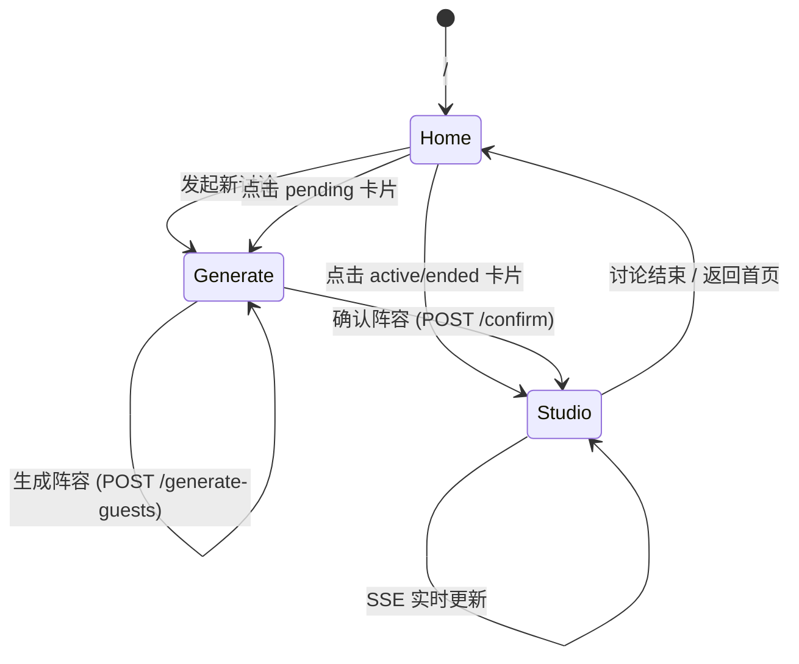
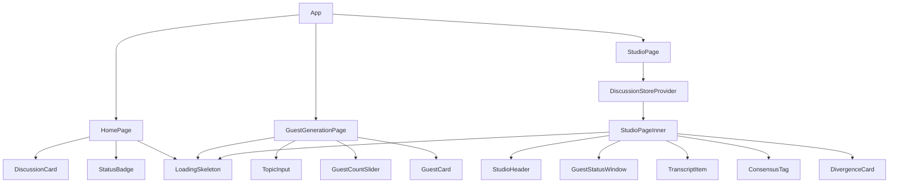
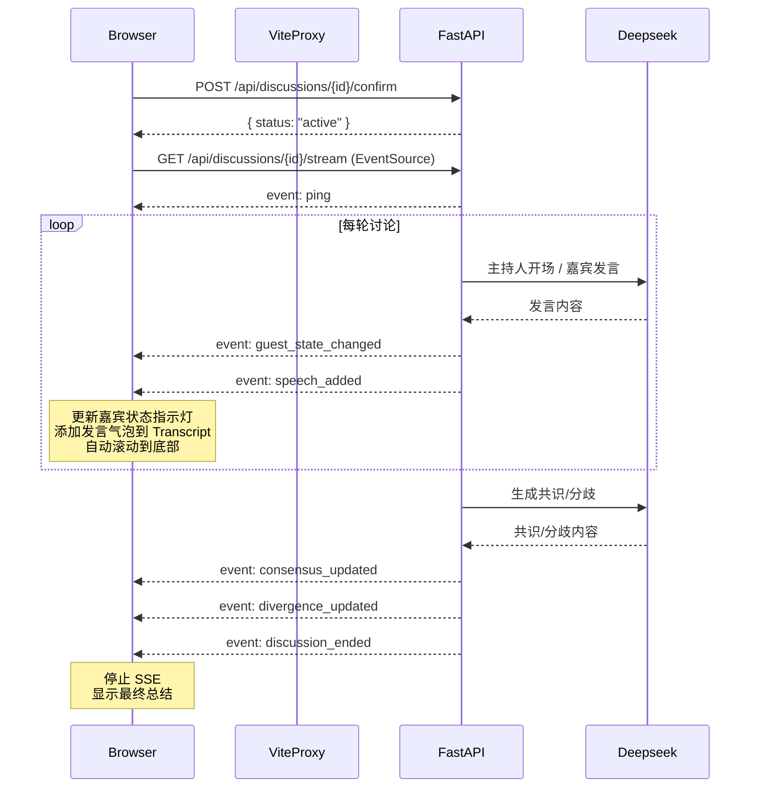
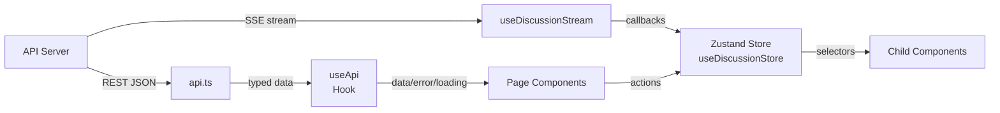

# AI Panel Studio — UI/UX 视觉规范文档

## 1. Visual Design System（视觉设计系统）

### 1.1 色彩体系

| Token | 色值 | 用途 |
|-------|------|------|
| `studio-bg` | `#0A0E27` | 全局背景色 |
| `studio-card` | `#121838` | 卡片/面板表面 |
| `studio-border` | `#1E2756` | 边框/分割线 |
| `studio-accent` | `#00D4FF` | 霓虹蓝主点缀色 |
| `studio-accent-dim` | `#00D4FF33` | 点缀色淡化（20%透明度） |
| `studio-gold` | `#FFD700` | 主持人高亮 |
| `studio-gold-dim` | `#FFD70033` | 主持人高亮淡化 |

**嘉宾颜色：** 由后端 LLM 根据嘉宾角色自动分配（`Guest.color` 字段），前端在所有关联元素上统一使用该颜色（色条、头像背景、发言气泡左边框、状态指示器）。

### 1.2 字体

| 层级 | 字体 | 字重 | 行高 | 用途 |
|------|------|------|------|------|
| Display | Noto Sans SC Bold | 700 | 1.4 | 页面主标题（2xl） |
| Heading | Noto Sans SC SemiBold | 600 | 1.5 | 卡片标题（lg） |
| Body | Noto Sans SC Regular | 400 | 1.6 | 正文（base/sm） |
| Caption | Noto Sans SC Regular | 400 | 1.4 | 辅助文字（xs） |
| Mono | JetBrains Mono / Fira Code | 400 | 1.5 | 等宽（未在 MVP 中使用） |

**后备字体栈：** `"Noto Sans SC", "PingFang SC", system-ui, sans-serif`

Google Fonts 引入：`https://fonts.googleapis.com/css2?family=Noto+Sans+SC:wght@400;500;600;700&display=swap`

### 1.3 间距与圆角

| Token | 值 |
|-------|-----|
| 组件间隙 | `gap-4` (16px), `gap-6` (24px) |
| 内边距（卡片） | `p-5` (20px) |
| 内边距（紧凑） | `p-3` (12px) / `p-4` (16px) |
| 圆角（卡片） | `rounded-xl` (12px) |
| 圆角（按钮） | `rounded-xl` (12px) |
| 圆角（气泡） | `rounded-xl` (12px) |
| 圆角（头像） | `rounded-full` |

### 1.4 阴影

| Token | 值 |
|-------|-----|
| 卡片悬停 | `shadow-lg shadow-studio-accent/5` |
| 按钮投影 | `shadow-lg shadow-studio-accent/25` |
| 模态遮罩 | 无 |

---

## 2. Component Catalog（组件目录）

### 2.1 StatusBadge（状态徽章）

| 状态 | 背景 | 文字 | 图标 |
|------|------|------|------|
| `pending` | `bg-yellow-500/20` | `text-yellow-400` "待确认" | — |
| `active` | `bg-green-500/20` | `text-green-400` "进行中" | 绿色脉冲圆点 |
| `ended` | `bg-gray-500/20` | `text-gray-400` "已结束" | — |
| `error` | `bg-red-500/20` | `text-red-400` "异常" | — |

### 2.2 LoadingSkeleton（骨架屏）

| Variant | 视觉 |
|---------|------|
| `card` | 卡片形圆角矩形，内部 3 行高度条 + 底部时间条 |
| `text` | 3 行动态宽度条（100%, 83%, 67%） |
| `avatar` | 圆形 + 右侧 2 行文字条（含标题行） |
| `speech` | 左右交替的圆角气泡（75% + 67% 宽） |

所有骨架屏使用 `animate-pulse` 脉动动画。

### 2.3 DiscussionCard（讨论卡片）

**常规状态：** 话题标题（白色，line-clamp-2）、状态徽章（右上角）、嘉宾人数图标、轮次信息（仅 active）、相对时间。

**悬停：** `-translate-y-0.5` 微上移 + 边框变 `studio-accent/50` + 投影增强 + 标题变 `studio-accent`。

**点击：** `pending` → `/generate?discussion_id={id}`；`active`/`ended` → `/studio/{id}`。

### 2.4 GuestCard（嘉宾卡片）

**普通嘉宾：** `studio-border` 边框、左侧 4px 色条（`guest.color`）、圆形头像（名首字）、姓名 + profession·title + stance（3行截断）。

**主持人（highlighted）：** `studio-gold/50` 边框 + `studio-gold/10` 背景投影 + "主持人" 金色徽章。

### 2.5 GuestStatusWindow（嘉宾状态窗）

**状态映射：**

| agent_state | 指示灯颜色 | 动画 | 文字 |
|-------------|-----------|------|------|
| `idle` | `#6B7280` (灰) | 无 | "待机" |
| `ready` | `#FBBF24` (黄) | 无 | "准备中" |
| `thinking` | `#F59E0B` (琥珀) | 脉冲头像 + 呼吸边框 | "思考中..." |
| `speaking` | `#10B981` (绿) | 呼吸边框（`guest.color` 颜色） | "发言中" |

**思考摘要：** 取该嘉宾最近一次发言的前 50 字，灰色斜体显示。

### 2.6 TranscriptItem（发言气泡）

**布局规则：** 主持人发言靠左，普通嘉宾交替（index 偶数靠左，奇数靠右）。

**组件结构：**
- 4px 左边框（`guest.color` 颜色）
- 头部：姓名（嘉宾色）、主持人徽章（金色）、profession·title（灰）、发言类型徽章、相对时间
- 正文：`whitespace-pre-wrap` 保留换行

**最新消息动画：** `slideIn` 从下方滑入（0.3s ease-out）。

### 2.7 ConsensusTag（共识标签）

- 4px 绿色左边框（`border-l-green-500`）
- 图标 ✅ + "共识" 标签
- 共识内容正文
- 支持者头像行（`guest.color` 圆形，叠放 `-space-x-2`）

### 2.8 DivergenceCard（分歧卡片）

- 4px 红色左边框（`border-l-red-500`）
- 图标 ❌ + "分歧" 标签
- 分歧描述正文
- 对立观点配对：`[GuestA 彩色标签] VS [GuestB 彩色标签]`

### 2.9 TopicInput（话题输入框）

**状态：**
- 空白：显示 placeholder "输入你想讨论的话题，例如：AI 会取代人类创造力吗？"
- 输入中：右下角剩余字数（灰色）
- 接近上限（≤20）：字数变黄色
- 达上限（0）：字数变红色
- 禁用：灰色遮罩，`cursor-not-allowed`

### 2.10 GuestCountSlider（专家人数滑块）

- 范围：2-8（由 MIN_EXPERTS / MAX_EXPERTS 常量定义）
- 滑块：Tailwind `accent-studio-accent`
- 刻度：每个值下方显示数字
- 预览：N 个彩色圆点（8 色预设数组循环），逐步放大 + 不透明度递增

### 2.11 StudioHeader（演播厅顶栏）

- 背景：`spotlight-bg` spotlight 渐变（`radial-gradient` + `animation: spotlight 8s`）
- 左侧：话题标题 + 轮次徽章（`studio-accent`）
- 右侧：连接指示灯（绿/红）+ "结束讨论" 按钮（红）
- 结束确认：模态弹窗 "确定要结束当前讨论吗？" + 取消/确认按钮

---

## 3. Page Layouts（页面布局）

### 3.1 首页 (`/`)

```
┌─────────────────────────────────────────────────────────┐
│  🎙️ AI Panel Studio                    [+ 发起新讨论]  │
│                                                          │
│  ┌──────────┐ ┌──────────┐ ┌──────────┐                │
│  │ Card 1   │ │ Card 2   │ │ Card 3   │                │
│  │ 话题标题  │ │ 话题标题  │ │ 话题标题  │                │
│  │ ⚪ 待确认 │ │ 🟢 进行中 │ │ ⚫ 已结束 │                │
│  │ 3位专家   │ │ 第2/3轮   │ │ 1小时前   │                │
│  └──────────┘ └──────────┘ └──────────┘                │
│                                                          │
│  Grid: grid-cols-1 sm:grid-cols-2 lg:grid-cols-3       │
└─────────────────────────────────────────────────────────┘
```

### 3.2 嘉宾生成页 (`/generate`)

```
┌──────────────────────────────────────────────────────────┐
│  ← 返回首页                                              │
│  ┌──────────────────────┬───────────────────────────────┐│
│  │  配置区 (40%)        │  预览区 (60%)                  ││
│  │                      │                                ││
│  │  话题输入框          │  ┌─────────────────────────┐  ││
│  │  ┌────────────────┐  │  │ 主持人卡片 (金色边框)    │  ││
│  │  │                │  │  └─────────────────────────┘  ││
│  │  └────────────────┘  │  ┌──────────┐ ┌──────────┐   ││
│  │  专家人数: 4         │  │ Guest 1  │ │ Guest 2  │   ││
│  │  ●●●●●●●●──────     │  └──────────┘ └──────────┘   ││
│  │                      │  ┌──────────┐ ┌──────────┐   ││
│  │  [✨ 生成阵容]       │  │ Guest 3  │ │ Guest 4  │   ││
│  │                      │  └──────────┘ └──────────┘   ││
│  └──────────────────────┴───────────────────────────────┘│
│  Desktop: lg:flex-row                                   │
│  Mobile: flex-col (上下堆叠)                              │
└──────────────────────────────────────────────────────────┘
```

### 3.3 演播厅 (`/studio/:id`)

```
┌─ StudioHeader ───────────────────────────────────────────┐
│  AI会取代人类创造力吗？ │ 第 2/3 轮 │ 🟢 已连接 │ [结束]  │
├────────────┬──────────────────────┬──────────────────────┤
│ 嘉宾 (25%) │ 现场实录 (50%)       │ 💡 共识·分歧 (25%)   │
│            │                      │                      │
│ [主持人]   │ ┌ 主持人开场白 ────┐ │ ✅ 共识1             │
│ 🟢 发言中  │ │ 各位来宾，今天我们│ │ 支持者: [张][李]    │
│            │ │ 讨论...          │ │                      │
│ [专家A]    │ └──────────────────┘ │ ✅ 共识2             │
│ 🟡 准备中  │     ┌ 专家A观点 ──┐ │                      │
│            │     │ 我认为AI工具...│ │ ❌ 分歧1             │
│ [专家B]    │     └──────────────┘ │ [张] VS [李]        │
│ ⚪ 待机    │ ┌ 专家B反驳 ───────┐ │                      │
│            │ │ 我不完全同意...  │ │ ❌ 分歧2             │
│ [专家C]    │ └──────────────────┘ │                      │
│ 🟡 思考中  │     ...              │                      │
│            │                      │                      │
└────────────┴──────────────────────┴──────────────────────┘
```

---

## 4. Animation Spec（动画规范）

| 动画名 | 关键帧 | 时长 | 缓动 | 触发条件 |
|--------|--------|------|------|----------|
| `breathe` | 0%: `shadow 0 0 4px`; 50%: `shadow 0 0 16px + 0 0 32px` | 2s | `ease-in-out` | guest speaking/thinking |
| `pulse-dot` | 0%: `opacity 1`; 50%: `opacity 0.3` | 1.5s | `ease-in-out` | active status dot |
| `slide-in` | from: `opacity 0, translateY(16px)`; to: `opacity 1, translateY(0)` | 0.3s | `ease-out` | new speech added |
| `fade-in` | from: `opacity 0`; to: `opacity 1` | 0.5s | `ease-out` | consensus/divergence first render |
| `spotlight` | 0%: `bgPos 0% 50%`; 50%: `bgPos 100% 50%` | 8s | `ease-in-out` | studio header background |
| `pulse` (avatar) | 0%: `scale(1)`; 50%: `scale(1.08)` | 1s | `ease-in-out` | guest thinking |

---

## 5. Interaction Design（交互设计）

### 5.1 点击目标

- 卡片：整张卡片可点击
- 按钮：最小点击区域 40px × 40px
- GuestStatusWindow：无点击（纯展示）

### 5.2 悬停状态

- DiscussionCard：边框从 `studio-border` → `studio-accent/50`，微上移 `-translate-y-0.5`
- 主按钮：投影增强，微上移
- 链接文字：颜色从 `gray-500` → `gray-300`

### 5.3 禁用状态

- 按钮：`opacity-50 + cursor-not-allowed`
- 输入框：`opacity-60 + cursor-not-allowed`
- 滑块：`opacity-50 + cursor-not-allowed`

### 5.4 焦点指示器

- 输入框：`focus:ring-2 focus:ring-studio-accent/50`
- 按钮：无额外焦点环（hover 态已足够）

---

## 6. Mermaid Diagrams

### 6.1 页面导航流



### 6.2 组件层级



### 6.3 SSE 事件序列



### 6.4 数据流



---

## 7. Responsive Strategy（响应式策略）

| 断点 | 宽度 | 演播厅布局 | 嘉宾生成布局 | 首页布局 |
|------|------|-----------|-------------|---------|
| 2XL | ≥1536px | 三栏 20%/55%/25% | 左右 40%/60% | 三列网格 |
| XL | ≥1280px | 三栏 25%/50%/25% (右侧始终显示) | 左右 40%/60% | 三列网格 |
| LG | ≥1024px | 三栏 25%/50%/25% (右侧可能隐藏于 xl:block) | 左右 40%/60% | 三列网格 |
| MD | ≥768px | 上下堆叠：嘉宾+洞察 / Transcript | 上下堆叠 | 两列网格 |
| SM | ≥640px | 上下堆叠 | 上下堆叠 | 两列网格 |
| <640px | 手机 | 垂直排列：Transcript → 嘉宾(手风琴) → 洞察(手风琴) | 垂直堆叠 | 单列网格 |

**演播厅移动端手风琴：**
- 嘉宾手风琴（`lg:hidden`，在 <1024px 时显示）：点击 "🎭 嘉宾 (N)" 展开/折叠
- 洞察手风琴（`xl:hidden`，在 <1280px 时显示）：点击 "💡 共识(N)·分歧(N)" 展开/折叠

---

## 8. Error / Empty / Loading State Catalog

### 8.1 首页

| 状态 | 视觉 |
|------|------|
| Loading | 4 张 `LoadingSkeleton variant="card"` |
| Empty | 🎙️ + "还没有讨论" + "来发起第一场 AI 圆桌吧！" + CTA 按钮 |
| Error | ⚠️ + 错误信息 + "重试" 按钮 |

### 8.2 嘉宾生成页

| 状态 | 视觉 |
|------|------|
| Loading（讨论详情） | `LoadingSkeleton variant="text"` |
| Generating（LLM 生成中） | 按钮内旋转图标 + "正在生成嘉宾阵容..." |
| Error（API） | 红色错误文本 + 重试按钮 |
| Error（503） | "AI 服务暂不可用，请稍后重试" |

### 8.3 演播厅

| 状态 | 视觉 |
|------|------|
| Loading（初始） | 三栏骨架屏布局 |
| Error（404） | 🔍 + "讨论不存在" + 返回首页链接 |
| Active + Connected | 实时 Transcript + 动画嘉宾状态 |
| Active + Disconnected | 黄色横幅 "⚠️ 连接中断，正在重连..." |
| Ended | 最终总结 Hero 区域 (🎉 + "讨论已结束" + 统计) |
| SSE Error (toast) | 右上角红色 Toast，5s 自动消失 |
| Transcript 空（active） | 🎬 + "讨论即将开始..." |
| 共识空 | "暂无共识" |
| 分歧空 | "暂无分歧" |
| 用户手动上滚 | 底部浮动 "↓ 新消息" 按钮 |

---

## 9. Technology Stack Summary

| 层级 | 技术 |
|------|------|
| 框架 | React 18 |
| 语言 | TypeScript 5 (strict mode) |
| 构建 | Vite 5 |
| 样式 | Tailwind CSS 3 + 3 CSS Modules |
| 路由 | React Router 6 |
| 状态 | Zustand 4 (store factory per discussion) |
| 实时 | EventSource (SSE) |
| HTTP | Fetch API (no axios) |
| 动画 | CSS `@keyframes` (no library) |
| 字体 | Noto Sans SC (Google Fonts) |
