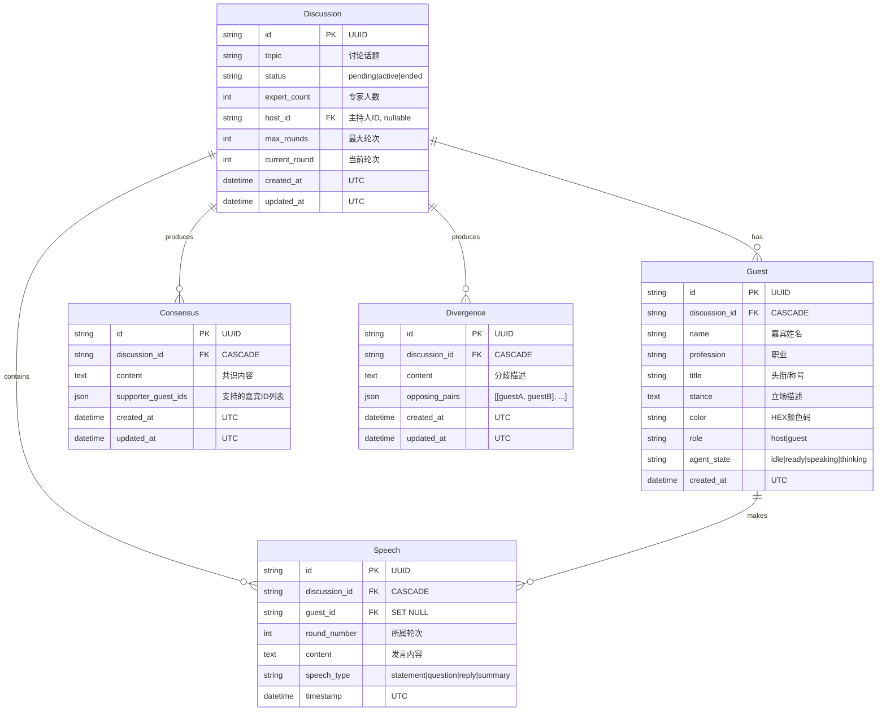

# AI Panel Studio 后端 — 实施计划

> **For agentic workers:** REQUIRED SUB-SKILL: Use superpowers:subagent-driven-development (recommended) or superpowers:executing-plans to implement this plan task-by-task. Steps use checkbox (`- [ ]`) syntax for tracking.

**Goal:** 构建 AI Panel Studio 后端，实现 AI 圆桌讨论的创建、嘉宾生成、全自动编排推进、SSE 实时事件推送、共识与分歧总结。

**Architecture:** FastAPI 分层架构 — routers（参数校验+路由）→ services（业务逻辑）→ models（数据持久化）。讨论编排引擎在后台异步任务中运行，通过 asyncio.Queue 向 SSE 端点广播事件。

**Tech Stack:** FastAPI + SQLite + SQLAlchemy (async) + httpx + sse-starlette + Deepseek API

## Global Constraints

- 数据库固定使用 SQLite + SQLAlchemy
- 前后端分离，后端框架使用 FastAPI
- 大模型 API Key 命名为 `DEEPSEEK_API_KEY`，仅从环境变量读取，不得硬编码
- 所有输出为中文
- 主键统一使用 UUID 字符串
- 所有时间字段使用 UTC 时区
- 外键明确级联策略（CASCADE / SET NULL）
- 讨论编排使用同步 SQLAlchemy + 后台线程（SQLite 不支持 async）

---

## File Structure

| 文件 | 职责 |
|------|------|
| `backend/requirements.txt` | 项目依赖声明 |
| `backend/.env.example` | 环境变量模板 |
| `backend/app/__init__.py` | 包标记（空） |
| `backend/app/config.py` | Settings 类，从环境变量读配置 |
| `backend/app/database.py` | SQLAlchemy 引擎、SessionLocal、Base |
| `backend/app/models.py` | 5 个 ORM 模型定义 |
| `backend/app/schemas.py` | Pydantic 请求/响应 Schema |
| `backend/app/services/__init__.py` | 包标记（空） |
| `backend/app/services/llm_client.py` | Deepseek API 封装 |
| `backend/app/services/discussion_service.py` | 讨论 CRUD 业务逻辑 |
| `backend/app/services/guest_service.py` | 嘉宾生成（调用 LLM） |
| `backend/app/services/orchestration_service.py` | 讨论编排引擎 + 事件广播 |
| `backend/app/routers/__init__.py` | 包标记（空） |
| `backend/app/routers/discussions.py` | 讨论管理路由 |
| `backend/app/routers/guests.py` | 嘉宾生成路由 |
| `backend/app/routers/events.py` | SSE 流 + 共识/分歧查询路由 |
| `backend/app/main.py` | FastAPI 入口，CORS，路由注册，启动事件 |
| `docs/PRD.md` | 产品需求文档 |
| `docs/ER.md` | 实体关系图（mermaid） |
| `docs/API.md` | API 契约文档 |

---

### Task 1: 项目脚手架

**Files:**
- Create: `backend/requirements.txt`
- Create: `backend/.env.example`
- Create: `backend/app/__init__.py`
- Create: `backend/app/config.py`
- Create: `backend/app/database.py`
- Create: `backend/app/services/__init__.py`
- Create: `backend/app/routers/__init__.py`

**Interfaces:**
- Produces: `config.Settings` — 配置单例，属性：`DEEPSEEK_API_KEY: str`、`DEEPSEEK_BASE_URL: str`、`DATABASE_URL: str`
- Produces: `database.SessionLocal` — `sessionmaker` 工厂
- Produces: `database.Base` — SQLAlchemy declarative base
- Produces: `database.init_db()` — 创建所有表
- Produces: `database.get_db()` — FastAPI 依赖，yield Session

- [ ] **Step 1: 创建 requirements.txt**

```
fastapi==0.115.6
uvicorn[standard]==0.34.0
sqlalchemy==2.0.36
pydantic==2.10.3
pydantic-settings==2.7.0
httpx==0.28.1
sse-starlette==2.2.1
python-dotenv==1.0.1
```

- [ ] **Step 2: 创建 .env.example**

```
DEEPSEEK_API_KEY=your-api-key-here
DEEPSEEK_BASE_URL=https://api.deepseek.com
DATABASE_URL=sqlite:///./ai_panel_studio.db
```

- [ ] **Step 3: 创建空 __init__.py 文件**

三个空文件：`backend/app/__init__.py`、`backend/app/services/__init__.py`、`backend/app/routers/__init__.py`

- [ ] **Step 4: 创建 config.py**

```python
from pydantic_settings import BaseSettings


class Settings(BaseSettings):
    DEEPSEEK_API_KEY: str = ""
    DEEPSEEK_BASE_URL: str = "https://api.deepseek.com"
    DATABASE_URL: str = "sqlite:///./ai_panel_studio.db"

    model_config = {"env_file": ".env", "env_file_encoding": "utf-8"}


settings = Settings()
```

- [ ] **Step 5: 创建 database.py**

```python
from sqlalchemy import create_engine
from sqlalchemy.orm import sessionmaker, declarative_base

from backend.app.config import settings

engine = create_engine(
    settings.DATABASE_URL,
    connect_args={"check_same_thread": False},  # SQLite 需要
    echo=False,
)

SessionLocal = sessionmaker(autocommit=False, autoflush=False, bind=engine)

Base = declarative_base()


def init_db():
    """创建所有表——在 app 启动时调用"""
    Base.metadata.create_all(bind=engine)


def get_db():
    """FastAPI 依赖注入：每个请求一个 session"""
    db = SessionLocal()
    try:
        yield db
    finally:
        db.close()
```

- [ ] **Step 6: 验证——启动 Python 导入检查**

```bash
cd backend && python -c "from app.config import settings; print(settings.DEEPSEEK_BASE_URL)"
```

预期：打印 `https://api.deepseek.com`

---

### Task 2: SQLAlchemy 数据模型

**Files:**
- Create: `backend/app/models.py`

**Interfaces:**
- Consumes: `database.Base` from Task 1
- Produces: `models.Discussion` — ORM 类，字段见设计文档第四节
- Produces: `models.Guest` — ORM 类
- Produces: `models.Speech` — ORM 类
- Produces: `models.Consensus` — ORM 类
- Produces: `models.Divergence` — ORM 类

- [ ] **Step 1: 编写 models.py**

```python
import uuid
from datetime import datetime, timezone

from sqlalchemy import (
    Column, String, Integer, Text, DateTime, ForeignKey, Index, JSON
)
from sqlalchemy.orm import relationship

from backend.app.database import Base


def _utcnow():
    return datetime.now(timezone.utc)


def _new_uuid():
    return str(uuid.uuid4())


class Discussion(Base):
    __tablename__ = "discussions"

    id = Column(String(36), primary_key=True, default=_new_uuid)
    topic = Column(String(200), nullable=False)
    status = Column(String(20), nullable=False, default="pending")  # pending | active | ended
    expert_count = Column(Integer, nullable=False, default=3)
    host_id = Column(String(36), ForeignKey("guests.id", ondelete="SET NULL"), nullable=True)
    max_rounds = Column(Integer, nullable=False, default=3)
    current_round = Column(Integer, nullable=False, default=0)
    created_at = Column(DateTime(timezone=True), nullable=False, default=_utcnow)
    updated_at = Column(DateTime(timezone=True), nullable=False, default=_utcnow, onupdate=_utcnow)

    guests = relationship("Guest", back_populates="discussion", foreign_keys="Guest.discussion_id")
    speeches = relationship("Speech", back_populates="discussion", cascade="all, delete-orphan")
    consensus_list = relationship("Consensus", back_populates="discussion", cascade="all, delete-orphan")
    divergence_list = relationship("Divergence", back_populates="discussion", cascade="all, delete-orphan")

    __table_args__ = (
        Index("ix_discussions_status", "status"),
        Index("ix_discussions_created_at", "created_at"),
    )


class Guest(Base):
    __tablename__ = "guests"

    id = Column(String(36), primary_key=True, default=_new_uuid)
    discussion_id = Column(String(36), ForeignKey("discussions.id", ondelete="CASCADE"), nullable=False)
    name = Column(String(100), nullable=False)
    profession = Column(String(100), nullable=False)
    title = Column(String(200), nullable=False)
    stance = Column(Text, nullable=False)
    color = Column(String(7), nullable=False)
    role = Column(String(10), nullable=False, default="guest")  # host | guest
    agent_state = Column(String(20), nullable=False, default="idle")  # idle | ready | speaking | thinking
    created_at = Column(DateTime(timezone=True), nullable=False, default=_utcnow)

    discussion = relationship("Discussion", back_populates="guests", foreign_keys=[discussion_id])
    speeches = relationship("Speech", back_populates="guest", cascade="all, delete-orphan")

    __table_args__ = (
        Index("ix_guests_discussion_id", "discussion_id"),
        Index("ix_guests_role", "role"),
    )


class Speech(Base):
    __tablename__ = "speeches"

    id = Column(String(36), primary_key=True, default=_new_uuid)
    discussion_id = Column(String(36), ForeignKey("discussions.id", ondelete="CASCADE"), nullable=False)
    guest_id = Column(String(36), ForeignKey("guests.id", ondelete="SET NULL"), nullable=True)
    round_number = Column(Integer, nullable=False)
    content = Column(Text, nullable=False)
    speech_type = Column(String(20), nullable=False)  # statement | question | reply | summary
    timestamp = Column(DateTime(timezone=True), nullable=False, default=_utcnow)

    discussion = relationship("Discussion", back_populates="speeches")
    guest = relationship("Guest", back_populates="speeches")

    __table_args__ = (
        Index("ix_speeches_discussion_id", "discussion_id"),
        Index("ix_speeches_guest_id", "guest_id"),
        Index("ix_speeches_disc_round", "discussion_id", "round_number"),
    )


class Consensus(Base):
    __tablename__ = "consensus"

    id = Column(String(36), primary_key=True, default=_new_uuid)
    discussion_id = Column(String(36), ForeignKey("discussions.id", ondelete="CASCADE"), nullable=False)
    content = Column(Text, nullable=False)
    supporter_guest_ids = Column(JSON, nullable=False)  # SQLite 存为 TEXT，SQLAlchemy JSON 自动序列化
    created_at = Column(DateTime(timezone=True), nullable=False, default=_utcnow)
    updated_at = Column(DateTime(timezone=True), nullable=False, default=_utcnow, onupdate=_utcnow)

    discussion = relationship("Discussion", back_populates="consensus_list")

    __table_args__ = (
        Index("ix_consensus_discussion_id", "discussion_id"),
    )


class Divergence(Base):
    __tablename__ = "divergence"

    id = Column(String(36), primary_key=True, default=_new_uuid)
    discussion_id = Column(String(36), ForeignKey("discussions.id", ondelete="CASCADE"), nullable=False)
    content = Column(Text, nullable=False)
    opposing_pairs = Column(JSON, nullable=False)  # [[guest_id_A, guest_id_B], ...]
    created_at = Column(DateTime(timezone=True), nullable=False, default=_utcnow)
    updated_at = Column(DateTime(timezone=True), nullable=False, default=_utcnow, onupdate=_utcnow)

    discussion = relationship("Discussion", back_populates="divergence_list")

    __table_args__ = (
        Index("ix_divergence_discussion_id", "discussion_id"),
    )
```

- [ ] **Step 2: 验证——创建表并检查结构**

```bash
cd backend && python -c "
from app.database import init_db, engine
init_db()
from sqlalchemy import inspect
inspector = inspect(engine)
tables = inspector.get_table_names()
print('Tables:', tables)
for t in tables:
    print(f'\n{t}:')
    for col in inspector.get_columns(t):
        print(f'  {col[\"name\"]} ({col[\"type\"]})')
"
```

预期：打印 5 张表及其列定义

---

### Task 3: Pydantic Schema 定义

**Files:**
- Create: `backend/app/schemas.py`

**Interfaces:**
- Consumes: 无（纯数据定义，引用 models 中的类型语义）
- Produces: 所有请求/响应 Schema（见下方代码）

- [ ] **Step 1: 编写 schemas.py**

```python
from __future__ import annotations

from datetime import datetime
from typing import Optional

from pydantic import BaseModel, Field


# ─── Discussion ──────────────────────────────────────────────

class DiscussionCreate(BaseModel):
    topic: str = Field(..., min_length=1, max_length=200, description="讨论话题")
    expert_count: int = Field(default=3, ge=1, le=10, description="专家人数（不含主持人）")
    max_rounds: int = Field(default=3, ge=1, le=10, description="最大讨论轮次")


class DiscussionResponse(BaseModel):
    id: str
    topic: str
    status: str
    expert_count: int
    host_id: Optional[str] = None
    max_rounds: int
    current_round: int
    created_at: datetime
    updated_at: datetime

    model_config = {"from_attributes": True}


class DiscussionListResponse(BaseModel):
    discussions: list[DiscussionResponse]
    total: int


class DiscussionDetailResponse(DiscussionResponse):
    guests: list[GuestResponse] = []
    speeches: list[SpeechResponse] = []


class StatusResponse(BaseModel):
    status: str


# ─── Guest ───────────────────────────────────────────────────

class GuestResponse(BaseModel):
    id: str
    discussion_id: str
    name: str
    profession: str
    title: str
    stance: str
    color: str
    role: str
    agent_state: str
    created_at: datetime

    model_config = {"from_attributes": True}


# ─── Speech ──────────────────────────────────────────────────

class SpeechResponse(BaseModel):
    id: str
    discussion_id: str
    guest_id: Optional[str] = None
    round_number: int
    content: str
    speech_type: str
    timestamp: datetime

    model_config = {"from_attributes": True}


class SpeechEvent(BaseModel):
    speech: SpeechResponse
    round_number: int


# ─── Consensus ───────────────────────────────────────────────

class ConsensusResponse(BaseModel):
    id: str
    discussion_id: str
    content: str
    supporter_guest_ids: list[str]
    created_at: datetime
    updated_at: datetime

    model_config = {"from_attributes": True}


class ConsensusEvent(BaseModel):
    consensus: ConsensusResponse


# ─── Divergence ──────────────────────────────────────────────

class DivergenceResponse(BaseModel):
    id: str
    discussion_id: str
    content: str
    opposing_pairs: list[list[str]]
    created_at: datetime
    updated_at: datetime

    model_config = {"from_attributes": True}


class DivergenceEvent(BaseModel):
    divergence: DivergenceResponse


# ─── SSE Events ──────────────────────────────────────────────

class GuestStateEvent(BaseModel):
    guest_id: str
    agent_state: str


class DiscussionEndedEvent(BaseModel):
    discussion_id: str
    final_consensus: list[ConsensusResponse]
    final_divergence: list[DivergenceResponse]


class ErrorEvent(BaseModel):
    code: str
    message: str


# ─── Guest Generation ────────────────────────────────────────

class GenerateGuestsResponse(BaseModel):
    guests: list[GuestResponse]
```

- [ ] **Step 2: 验证 Pydantic 模型**

```bash
cd backend && python -c "
from app.schemas import DiscussionCreate, DiscussionResponse
d = DiscussionCreate(topic='AI 会取代程序员吗', expert_count=3)
print('Create:', d.model_dump())
# 测试 from_attributes 配置
print('ORM mode:', DiscussionResponse.model_config.get('from_attributes'))
"
```

预期：正常打印字典，`from_attributes` 为 `True`

---

### Task 4: LLM 客户端

**Files:**
- Create: `backend/app/services/llm_client.py`

**Interfaces:**
- Consumes: `config.settings` from Task 1
- Produces: `LLMClient` 类
  - `async chat_completion(messages: list[dict], temperature: float = 0.8) -> str` — 发送请求，返回 assistant 回复文本
  - `async generate_guests(topic: str, expert_count: int) -> list[dict]` — 调用 LLM 生成嘉宾阵容，返回嘉宾 dict 列表
  - `async generate_speech(guest_name: str, guest_stance: str, role: str, discussion_context: list[dict], speech_purpose: str) -> str` — 生成单次发言

- [ ] **Step 1: 编写 llm_client.py**

```python
import json
import httpx
from backend.app.config import settings

SYSTEM_PROMPT_GENERATE_GUESTS = """你是一个圆桌讨论的策划者。用户会提供一个讨论话题和需要的专家人数，请你设计一个AI嘉宾阵容。

要求：
1. 生成 1 位主持人 + N 位专家嘉宾（N = 用户指定的人数）
2. 主持人：立场中立，擅长引导讨论，名字、职业、头衔、立场描述合理
3. 专家嘉宾：从不同角度/立场切入话题，每位专家的立场应当各有侧重、形成观点的碰撞
4. 为每位嘉宾分配一个专属的十六进制颜色码（HEX），主持人用沉稳色（如 #4A90D9），专家用鲜明区分色

返回严格的 JSON 格式（不要包含 markdown 代码块标记）：
{
  "guests": [
    {
      "name": "张三",
      "profession": "软件工程师",
      "title": "资深全栈开发者",
      "stance": "认为 AI 将大幅提升编程效率，但不会完全替代程序员...",
      "color": "#FF6B6B",
      "role": "guest"
    }
  ]
}

注意：第一条为主持人（role="host"），其余为专家（role="guest"）。"""


class LLMClient:
    def __init__(self):
        self.api_key = settings.DEEPSEEK_API_KEY
        self.base_url = settings.DEEPSEEK_BASE_URL.rstrip("/")
        self.model = "deepseek-chat"  # Deepseek V4 Pro

    @property
    def _headers(self) -> dict:
        return {
            "Authorization": f"Bearer {self.api_key}",
            "Content-Type": "application/json",
        }

    async def chat_completion(
        self, messages: list[dict], temperature: float = 0.8
    ) -> str:
        """发送聊天补全请求，返回 assistant 文本回复"""
        payload = {
            "model": self.model,
            "messages": messages,
            "temperature": temperature,
            "stream": False,
        }
        async with httpx.AsyncClient(timeout=120.0) as client:
            response = await client.post(
                f"{self.base_url}/v1/chat/completions",
                headers=self._headers,
                json=payload,
            )
            response.raise_for_status()
            data = response.json()
            return data["choices"][0]["message"]["content"]

    async def generate_guests(self, topic: str, expert_count: int) -> list[dict]:
        """生成 1 位主持人 + N 位专家"""
        user_message = f"讨论话题：{topic}\n专家人数：{expert_count}"
        messages = [
            {"role": "system", "content": SYSTEM_PROMPT_GENERATE_GUESTS},
            {"role": "user", "content": user_message},
        ]
        raw = await self.chat_completion(messages, temperature=0.9)
        # 清洗可能的 markdown 代码块标记
        raw = raw.strip()
        if raw.startswith("```"):
            lines = raw.split("\n")
            lines = [l for l in lines if not l.startswith("```")]
            raw = "\n".join(lines)
        result = json.loads(raw)
        return result["guests"]

    async def generate_speech(
        self,
        guest_name: str,
        guest_stance: str,
        role: str,
        discussion_context: list[dict],
        speech_purpose: str,
    ) -> str:
        """为指定嘉宾生成发言内容"""
        system_prompt = f"""你正在参加一场AI圆桌讨论。你的身份是：

姓名：{guest_name}
角色：{"主持人" if role == "host" else "专家嘉宾"}
立场：{guest_stance}

发言要求：{speech_purpose}

请以第一人称发言，语气自然、专业，像真实圆桌讨论中的发言。发言长度控制在 150-400 字之间。"""

        messages = [{"role": "system", "content": system_prompt}]
        # 追加讨论上下文（最近 20 条消息以控制 token）
        messages.extend(discussion_context[-20:])

        return await self.chat_completion(messages, temperature=0.8)
```

- [ ] **Step 2: 验证——导入模块**

```bash
cd backend && python -c "from app.services.llm_client import LLMClient; print('LLMClient imported OK')"
```

预期：打印 `LLMClient imported OK`

---

### Task 5: 讨论服务

**Files:**
- Create: `backend/app/services/discussion_service.py`

**Interfaces:**
- Consumes: `models.Discussion`, `models.Guest`, `models.Speech` from Task 2; `schemas.*` from Task 3; `database.Session` from Task 1
- Produces:
  - `create_discussion(db, data: DiscussionCreate) -> Discussion`
  - `get_discussion(db, discussion_id: str) -> Discussion | None`
  - `list_discussions(db, page: int, page_size: int) -> tuple[list[Discussion], int]`
  - `get_discussion_detail(db, discussion_id: str) -> Discussion | None`
  - `confirm_discussion(db, discussion_id: str) -> Discussion`
  - `end_discussion(db, discussion_id: str) -> Discussion`

- [ ] **Step 1: 编写 discussion_service.py**

```python
from sqlalchemy.orm import Session, joinedload

from backend.app.models import Discussion
from backend.app.schemas import DiscussionCreate


def create_discussion(db: Session, data: DiscussionCreate) -> Discussion:
    discussion = Discussion(
        topic=data.topic,
        expert_count=data.expert_count,
        max_rounds=data.max_rounds,
    )
    db.add(discussion)
    db.commit()
    db.refresh(discussion)
    return discussion


def get_discussion(db: Session, discussion_id: str) -> Discussion | None:
    return db.query(Discussion).filter(Discussion.id == discussion_id).first()


def list_discussions(db: Session, page: int = 1, page_size: int = 20) -> tuple[list[Discussion], int]:
    total = db.query(Discussion).count()
    discussions = (
        db.query(Discussion)
        .order_by(Discussion.created_at.desc())
        .offset((page - 1) * page_size)
        .limit(page_size)
        .all()
    )
    return discussions, total


def get_discussion_detail(db: Session, discussion_id: str) -> Discussion | None:
    return (
        db.query(Discussion)
        .options(
            joinedload(Discussion.guests),
            joinedload(Discussion.speeches),
        )
        .filter(Discussion.id == discussion_id)
        .first()
    )


def confirm_discussion(db: Session, discussion_id: str) -> Discussion:
    """确认嘉宾阵容，将状态从 pending 改为 active"""
    discussion = get_discussion_detail(db, discussion_id)
    if discussion is None:
        raise ValueError("讨论不存在")
    if discussion.status != "pending":
        raise ValueError(f"讨论状态为 '{discussion.status}'，无法确认")
    # 回填 host_id
    host = next((g for g in discussion.guests if g.role == "host"), None)
    if host:
        discussion.host_id = host.id
    discussion.status = "active"
    db.commit()
    db.refresh(discussion)
    return discussion


def end_discussion(db: Session, discussion_id: str) -> Discussion:
    """结束讨论，将状态从 active 改为 ended"""
    discussion = get_discussion(db, discussion_id)
    if discussion is None:
        raise ValueError("讨论不存在")
    if discussion.status != "active":
        raise ValueError(f"讨论状态为 '{discussion.status}'，无法结束")
    discussion.status = "ended"
    db.commit()
    db.refresh(discussion)
    return discussion
```

- [ ] **Step 2: 验证——导入模块**

```bash
cd backend && python -c "from app.services.discussion_service import create_discussion, list_discussions; print('discussion_service imported OK')"
```

预期：`discussion_service imported OK`

---

### Task 6: 嘉宾服务

**Files:**
- Create: `backend/app/services/guest_service.py`

**Interfaces:**
- Consumes: `models.Guest`, `models.Discussion` from Task 2; `llm_client.LLMClient` from Task 4
- Produces:
  - `async generate_guests_for_discussion(db, llm, discussion_id) -> list[Guest]` — 调用 LLM 生成嘉宾并持久化

- [ ] **Step 1: 编写 guest_service.py**

```python
from sqlalchemy.orm import Session

from backend.app.models import Discussion, Guest
from backend.app.services.llm_client import LLMClient


async def generate_guests_for_discussion(
    db: Session,
    llm: LLMClient,
    discussion_id: str,
) -> list[Guest]:
    """调用 LLM 生成嘉宾阵容并写入数据库"""
    discussion = db.query(Discussion).filter(Discussion.id == discussion_id).first()
    if discussion is None:
        raise ValueError("讨论不存在")
    if discussion.status != "pending":
        raise ValueError("讨论状态不允许生成嘉宾")

    # 清除旧嘉宾（如果重新生成）
    db.query(Guest).filter(Guest.discussion_id == discussion_id).delete()

    # 调用 LLM
    guest_dicts = await llm.generate_guests(discussion.topic, discussion.expert_count)

    # 写入数据库
    guests = []
    for gd in guest_dicts:
        guest = Guest(
            discussion_id=discussion_id,
            name=gd["name"],
            profession=gd["profession"],
            title=gd["title"],
            stance=gd["stance"],
            color=gd["color"],
            role=gd.get("role", "guest"),
            agent_state="ready",
        )
        db.add(guest)
        guests.append(guest)

    db.commit()
    for g in guests:
        db.refresh(g)
    return guests
```

- [ ] **Step 2: 验证——导入模块**

```bash
cd backend && python -c "from app.services.guest_service import generate_guests_for_discussion; print('guest_service imported OK')"
```

预期：`guest_service imported OK`

---

### Task 7: 编排引擎

**Files:**
- Create: `backend/app/services/orchestration_service.py`

**Interfaces:**
- Consumes: `models.*` from Task 2; `llm_client.LLMClient` from Task 4; `schemas.*` from Task 3
- Produces:
  - `DiscussionOrchestrator` 类：
    - `__init__(self)`: 初始化 `_event_queues: dict[str, list[asyncio.Queue]]`
    - `subscribe(discussion_id: str) -> asyncio.Queue`: 注册 SSE 客户端，返回其专属队列
    - `unsubscribe(discussion_id: str, queue: asyncio.Queue)`: 取消注册
    - `_broadcast(discussion_id: str, event: str, data: dict)`: 向所有订阅者广播事件
    - `run_discussion(db_session_factory, discussion_id: str)`: 在后台线程中执行全自动讨论编排
  - `orchestrator` — 全局单例

- [ ] **Step 1: 编写 orchestration_service.py**

```python
import asyncio
import json
import threading
from datetime import datetime, timezone

from backend.app.models import Discussion, Guest, Speech, Consensus, Divergence
from backend.app.services.llm_client import LLMClient


class DiscussionOrchestrator:
    """讨论编排引擎：管理 SSE 事件广播 + 后台自动推进讨论"""

    def __init__(self):
        # discussion_id -> list[asyncio.Queue]
        self._event_queues: dict[str, list[asyncio.Queue]] = {}
        self._lock = threading.Lock()

    def subscribe(self, discussion_id: str) -> asyncio.Queue:
        """注册 SSE 客户端，返回其专属事件队列"""
        q: asyncio.Queue = asyncio.Queue()
        with self._lock:
            if discussion_id not in self._event_queues:
                self._event_queues[discussion_id] = []
            self._event_queues[discussion_id].append(q)
        return q

    def unsubscribe(self, discussion_id: str, queue: asyncio.Queue):
        """取消注册 SSE 客户端"""
        with self._lock:
            queues = self._event_queues.get(discussion_id, [])
            if queue in queues:
                queues.remove(queue)

    def _broadcast(self, discussion_id: str, event: str, data: dict):
        """向所有订阅者广播 SSE 事件（线程安全）"""
        with self._lock:
            queues = list(self._event_queues.get(discussion_id, []))
        payload = json.dumps(data, ensure_ascii=False)
        for q in queues:
            try:
                q.put_nowait({"event": event, "data": payload})
            except asyncio.QueueFull:
                pass

    def _build_context(self, speeches: list[Speech], guests: dict[str, Guest]) -> list[dict]:
        """用已有发言构建 LLM 上下文消息列表"""
        messages = []
        for s in speeches:
            guest = guests.get(s.guest_id) if s.guest_id else None
            name = guest.name if guest else "未知嘉宾"
            messages.append({
                "role": "user",
                "content": f"【{name}】({s.speech_type}): {s.content}",
            })
        return messages

    def run_discussion(self, session_factory, discussion_id: str):
        """在后台线程中运行全自动讨论（同步数据库操作）"""
        import time

        llm = LLMClient()
        db = session_factory()

        try:
            discussion = db.query(Discussion).filter(Discussion.id == discussion_id).first()
            if not discussion or discussion.status != "active":
                return

            guests = db.query(Guest).filter(Guest.discussion_id == discussion_id).all()
            guest_map = {g.id: g for g in guests}
            host = next((g for g in guests if g.role == "host"), None)
            experts = [g for g in guests if g.role == "guest"]

            all_speeches: list[Speech] = []

            for round_num in range(1, discussion.max_rounds + 1):
                # 更新当前轮次
                discussion.current_round = round_num
                db.commit()

                # ── 主持人开场/引导 ──
                if host:
                    self._set_agent_state(db, host, "thinking")
                    self._broadcast(discussion_id, "guest_state_changed", {
                        "guest_id": host.id, "agent_state": "thinking"
                    })

                    if round_num == 1:
                        purpose = f"作为主持人，请你围绕「{discussion.topic}」做开场白，简要介绍话题背景，并引导各位专家依次发表观点。"
                    else:
                        purpose = f"第 {round_num} 轮开始。请基于前面的讨论，提炼关键争议点，引导专家们深入辩论或回应之前的观点。"
                    context = self._build_context(all_speeches, guest_map)
                    content = asyncio.run(llm.generate_speech(
                        host.name, host.stance, "host", context, purpose
                    ))

                    self._set_agent_state(db, host, "speaking")
                    self._broadcast(discussion_id, "guest_state_changed", {
                        "guest_id": host.id, "agent_state": "speaking"
                    })

                    speech = self._save_speech(db, discussion_id, host.id, round_num, content,
                                               "question" if round_num > 1 else "statement")
                    all_speeches.append(speech)
                    event_data = self._speech_to_event(speech)
                    self._broadcast(discussion_id, "speech_added", event_data)

                    self._set_agent_state(db, host, "ready")
                    self._broadcast(discussion_id, "guest_state_changed", {
                        "guest_id": host.id, "agent_state": "ready"
                    })

                    time.sleep(0.5)  # 短暂间隔让前端有时间渲染

                # ── 专家依次发言 ──
                for expert in experts:
                    self._set_agent_state(db, expert, "thinking")
                    self._broadcast(discussion_id, "guest_state_changed", {
                        "guest_id": expert.id, "agent_state": "thinking"
                    })

                    purpose = f"第 {round_num} 轮发言。请基于讨论话题「{discussion.topic}」和之前的讨论内容，发表你的专业观点。保持与你的立场（{expert.stance}）一致。"
                    context = self._build_context(all_speeches, guest_map)
                    content = asyncio.run(llm.generate_speech(
                        expert.name, expert.stance, "guest", context, purpose
                    ))

                    self._set_agent_state(db, expert, "speaking")
                    self._broadcast(discussion_id, "guest_state_changed", {
                        "guest_id": expert.id, "agent_state": "speaking"
                    })

                    speech = self._save_speech(db, discussion_id, expert.id, round_num, content, "statement")
                    all_speeches.append(speech)
                    event_data = self._speech_to_event(speech)
                    self._broadcast(discussion_id, "speech_added", event_data)

                    self._set_agent_state(db, expert, "ready")
                    self._broadcast(discussion_id, "guest_state_changed", {
                        "guest_id": expert.id, "agent_state": "ready"
                    })

                    time.sleep(0.5)

                # ── 主持人本轮小结 ──
                if host:
                    self._set_agent_state(db, host, "thinking")
                    self._broadcast(discussion_id, "guest_state_changed", {
                        "guest_id": host.id, "agent_state": "thinking"
                    })

                    purpose = f"第 {round_num} 轮即将结束。请对刚才各位专家的发言做一个简要小结，提炼关键观点和共识/分歧线索。"
                    context = self._build_context(all_speeches, guest_map)
                    content = asyncio.run(llm.generate_speech(
                        host.name, host.stance, "host", context, purpose
                    ))

                    self._set_agent_state(db, host, "speaking")
                    self._broadcast(discussion_id, "guest_state_changed", {
                        "guest_id": host.id, "agent_state": "speaking"
                    })

                    speech = self._save_speech(db, discussion_id, host.id, round_num, content, "summary")
                    all_speeches.append(speech)
                    event_data = self._speech_to_event(speech)
                    self._broadcast(discussion_id, "speech_added", event_data)

                    self._set_agent_state(db, host, "ready")
                    self._broadcast(discussion_id, "guest_state_changed", {
                        "guest_id": host.id, "agent_state": "ready"
                    })

                    time.sleep(0.5)

            # ── 全部轮次结束：生成共识与分歧 ──
            if host:
                self._generate_summary(db, llm, discussion_id, host, guests, all_speeches, guest_map)

            # ── 标记讨论结束 ──
            discussion.status = "ended"
            db.commit()

            final_consensus = [
                {
                    "id": c.id, "discussion_id": c.discussion_id, "content": c.content,
                    "supporter_guest_ids": c.supporter_guest_ids,
                    "created_at": c.created_at.isoformat(), "updated_at": c.updated_at.isoformat(),
                }
                for c in db.query(Consensus).filter(Consensus.discussion_id == discussion_id).all()
            ]
            final_divergence = [
                {
                    "id": d.id, "discussion_id": d.discussion_id, "content": d.content,
                    "opposing_pairs": d.opposing_pairs,
                    "created_at": d.created_at.isoformat(), "updated_at": d.updated_at.isoformat(),
                }
                for d in db.query(Divergence).filter(Divergence.discussion_id == discussion_id).all()
            ]
            self._broadcast(discussion_id, "discussion_ended", {
                "discussion_id": discussion_id,
                "final_consensus": final_consensus,
                "final_divergence": final_divergence,
            })

        except Exception as e:
            self._broadcast(discussion_id, "error", {"code": "ORCHESTRATION_ERROR", "message": str(e)})
        finally:
            db.close()

    def _set_agent_state(self, db, guest: Guest, state: str):
        guest.agent_state = state
        db.commit()
        db.refresh(guest)

    def _save_speech(self, db, discussion_id: str, guest_id: str, round_num: int, content: str, speech_type: str) -> Speech:
        speech = Speech(
            discussion_id=discussion_id,
            guest_id=guest_id,
            round_number=round_num,
            content=content,
            speech_type=speech_type,
            timestamp=datetime.now(timezone.utc),
        )
        db.add(speech)
        db.commit()
        db.refresh(speech)
        return speech

    def _speech_to_event(self, speech: Speech) -> dict:
        return {
            "speech": {
                "id": speech.id,
                "discussion_id": speech.discussion_id,
                "guest_id": speech.guest_id,
                "round_number": speech.round_number,
                "content": speech.content,
                "speech_type": speech.speech_type,
                "timestamp": speech.timestamp.isoformat(),
            },
            "round_number": speech.round_number,
        }

    def _generate_summary(self, db, llm: LLMClient, discussion_id: str, host: Guest,
                          guests: list[Guest], all_speeches: list[Speech], guest_map: dict):
        """生成共识与分歧总结"""
        context = self._build_context(all_speeches, guest_map)
        expert_names = ", ".join([g.name for g in guests if g.role == "guest"])

        summary_prompt = f"""讨论已结束。请基于以上全部发言内容，总结出：

1. 共识（至少1条）：嘉宾们达成一致的要点，并标明哪些嘉宾支持该共识
2. 分歧（至少1条）：嘉宾们存在争议的要点，并标明对立双方的嘉宾姓名对

返回严格的 JSON 格式（不要 markdown 代码块）：
{{
  "consensus_list": [
    {{ "content": "共识内容", "supporter_names": ["张三", "李四"] }}
  ],
  "divergence_list": [
    {{ "content": "分歧描述", "opposing_names": [["张三", "李四"]] }}
  ]
}}

注意：supporter_names 和 opposing_names 中使用嘉宾的姓名（从上下文消息中的【姓名】格式获取）。
可供参考的嘉宾名单：主持人 {host.name}，专家：{expert_names}"""

        messages = context + [{"role": "user", "content": summary_prompt}]
        raw = asyncio.run(llm.chat_completion(messages, temperature=0.5))
        raw = raw.strip()
        if raw.startswith("```"):
            lines = raw.split("\n")
            lines = [l for l in lines if not l.startswith("```")]
            raw = "\n".join(lines)

        import json as _json
        result = _json.loads(raw)

        # 名字到 ID 的映射
        name_to_id = {g.name: g.id for g in guests}

        # 保存共识
        for c in result.get("consensus_list", []):
            supporter_ids = [name_to_id.get(n, "") for n in c.get("supporter_names", [])]
            supporter_ids = [sid for sid in supporter_ids if sid]
            consensus = Consensus(
                discussion_id=discussion_id,
                content=c["content"],
                supporter_guest_ids=supporter_ids,
            )
            db.add(consensus)
            db.commit()
            db.refresh(consensus)
            self._broadcast(discussion_id, "consensus_updated", {
                "consensus": {
                    "id": consensus.id, "discussion_id": consensus.discussion_id,
                    "content": consensus.content, "supporter_guest_ids": consensus.supporter_guest_ids,
                    "created_at": consensus.created_at.isoformat(), "updated_at": consensus.updated_at.isoformat(),
                }
            })

        # 保存分歧
        for d in result.get("divergence_list", []):
            opposing_pairs = []
            for pair in d.get("opposing_names", []):
                id_pair = [name_to_id.get(n, "") for n in pair]
                id_pair = [i for i in id_pair if i]
                if len(id_pair) == 2:
                    opposing_pairs.append(id_pair)
            divergence = Divergence(
                discussion_id=discussion_id,
                content=d["content"],
                opposing_pairs=opposing_pairs,
            )
            db.add(divergence)
            db.commit()
            db.refresh(divergence)
            self._broadcast(discussion_id, "divergence_updated", {
                "divergence": {
                    "id": divergence.id, "discussion_id": divergence.discussion_id,
                    "content": divergence.content, "opposing_pairs": divergence.opposing_pairs,
                    "created_at": divergence.created_at.isoformat(), "updated_at": divergence.updated_at.isoformat(),
                }
            })


# 全局单例
orchestrator = DiscussionOrchestrator()
```

- [ ] **Step 2: 验证——导入模块**

```bash
cd backend && python -c "from app.services.orchestration_service import orchestrator; print('Orchestrator singleton created OK')"
```

预期：`Orchestrator singleton created OK`

---

### Task 8: 讨论管理路由

**Files:**
- Create: `backend/app/routers/discussions.py`

**Interfaces:**
- Consumes: `discussion_service.*` from Task 5; `orchestration_service.orchestrator` from Task 7; `schemas.*` from Task 3; `database.get_db` from Task 1
- Produces: FastAPI APIRouter with prefix `/api/discussions`

- [ ] **Step 1: 编写 discussions.py**

```python
import threading
from fastapi import APIRouter, Depends, HTTPException
from sqlalchemy.orm import Session

from backend.app.database import get_db
from backend.app.schemas import (
    DiscussionCreate,
    DiscussionResponse,
    DiscussionListResponse,
    DiscussionDetailResponse,
    StatusResponse,
)
from backend.app.services import discussion_service
from backend.app.services.orchestration_service import orchestrator

router = APIRouter(prefix="/api/discussions", tags=["discussions"])


@router.get("", response_model=DiscussionListResponse)
def list_discussions(page: int = 1, page_size: int = 20, db: Session = Depends(get_db)):
    discussions, total = discussion_service.list_discussions(db, page, page_size)
    return DiscussionListResponse(
        discussions=[DiscussionResponse.model_validate(d) for d in discussions],
        total=total,
    )


@router.post("", response_model=DiscussionResponse, status_code=201)
def create_discussion(data: DiscussionCreate, db: Session = Depends(get_db)):
    discussion = discussion_service.create_discussion(db, data)
    return DiscussionResponse.model_validate(discussion)


@router.get("/{discussion_id}", response_model=DiscussionDetailResponse)
def get_discussion(discussion_id: str, db: Session = Depends(get_db)):
    discussion = discussion_service.get_discussion_detail(db, discussion_id)
    if discussion is None:
        raise HTTPException(status_code=404, detail="讨论不存在")
    return DiscussionDetailResponse.model_validate(discussion)


@router.post("/{discussion_id}/confirm", response_model=StatusResponse)
def confirm_discussion(discussion_id: str, db: Session = Depends(get_db)):
    try:
        discussion = discussion_service.confirm_discussion(db, discussion_id)
    except ValueError as e:
        raise HTTPException(status_code=400, detail=str(e))

    # 启动后台编排
    thread = threading.Thread(
        target=orchestrator.run_discussion,
        args=(discussion_service.SessionLocal, discussion_id),
        daemon=True,
    )
    thread.start()

    return StatusResponse(status=discussion.status)


@router.post("/{discussion_id}/end", response_model=StatusResponse)
def end_discussion(discussion_id: str, db: Session = Depends(get_db)):
    try:
        discussion = discussion_service.end_discussion(db, discussion_id)
    except ValueError as e:
        raise HTTPException(status_code=400, detail=str(e))
    return StatusResponse(status=discussion.status)
```

等等 —— `confirm_discussion` 中 `discussion_service.SessionLocal` 的引用需要修正，因为 `SessionLocal` 在 `database.py` 而非 `discussion_service.py`。修正如下：

`confirm_discussion` 的最后几行应改为：

```python
    from backend.app.database import SessionLocal
    thread = threading.Thread(
        target=orchestrator.run_discussion,
        args=(SessionLocal, discussion_id),
        daemon=True,
    )
```

- [ ] **Step 2: 验证——导入模块**

```bash
cd backend && python -c "from app.routers.discussions import router; print('Discussion router OK, routes:', [r.path for r in router.routes])"
```

预期：打印路由列表

---

### Task 9: 嘉宾生成路由

**Files:**
- Create: `backend/app/routers/guests.py`

**Interfaces:**
- Consumes: `guest_service.*` from Task 6; `llm_client.LLMClient` from Task 4; `schemas.*` from Task 3; `database.get_db` from Task 1
- Produces: FastAPI APIRouter with prefix `/api/discussions`

- [ ] **Step 1: 编写 guests.py**

```python
from fastapi import APIRouter, Depends, HTTPException
from sqlalchemy.orm import Session

from backend.app.database import get_db
from backend.app.schemas import GuestResponse, GenerateGuestsResponse
from backend.app.services.llm_client import LLMClient
from backend.app.services import guest_service

router = APIRouter(prefix="/api/discussions", tags=["guests"])


@router.post("/{discussion_id}/generate-guests", response_model=GenerateGuestsResponse)
async def generate_guests(discussion_id: str, db: Session = Depends(get_db)):
    llm = LLMClient()
    try:
        guests = await guest_service.generate_guests_for_discussion(db, llm, discussion_id)
    except ValueError as e:
        raise HTTPException(status_code=400, detail=str(e))
    except Exception as e:
        raise HTTPException(status_code=503, detail=f"LLM 服务不可用: {str(e)}")
    return GenerateGuestsResponse(
        guests=[GuestResponse.model_validate(g) for g in guests]
    )
```

- [ ] **Step 2: 验证——导入模块**

```bash
cd backend && python -c "from app.routers.guests import router; print('Guest router OK')"
```

预期：`Guest router OK`

---

### Task 10: SSE 事件流与共识/分歧路由

**Files:**
- Create: `backend/app/routers/events.py`

**Interfaces:**
- Consumes: `orchestration_service.orchestrator` from Task 7; `schemas.*` from Task 3; `models.*` from Task 2; `database.get_db` from Task 1
- Produces: FastAPI APIRouter with SSE endpoint + consensus/divergence GET endpoints

- [ ] **Step 1: 编写 events.py**

```python
import asyncio
import json

from fastapi import APIRouter, Depends, HTTPException, Request
from sqlalchemy.orm import Session
from sse_starlette.sse import EventSourceResponse

from backend.app.database import get_db
from backend.app.models import Consensus, Divergence
from backend.app.schemas import ConsensusResponse, DivergenceResponse
from backend.app.services.orchestration_service import orchestrator

router = APIRouter(prefix="/api/discussions", tags=["events"])


@router.get("/{discussion_id}/stream")
async def stream_discussion(discussion_id: str, request: Request):
    """SSE 实时事件流"""
    queue = orchestrator.subscribe(discussion_id)

    async def event_generator():
        try:
            while True:
                if await request.is_disconnected():
                    break
                try:
                    event_data = await asyncio.wait_for(queue.get(), timeout=15.0)
                    yield {
                        "event": event_data["event"],
                        "data": event_data["data"],
                    }
                except asyncio.TimeoutError:
                    # 发送心跳保持连接
                    yield {"event": "ping", "data": "{}"}
        finally:
            orchestrator.unsubscribe(discussion_id, queue)

    return EventSourceResponse(event_generator())


@router.get("/{discussion_id}/consensus", response_model=list[ConsensusResponse])
def get_consensus_list(discussion_id: str, db: Session = Depends(get_db)):
    items = db.query(Consensus).filter(Consensus.discussion_id == discussion_id).all()
    return [ConsensusResponse.model_validate(c) for c in items]


@router.get("/{discussion_id}/divergence", response_model=list[DivergenceResponse])
def get_divergence_list(discussion_id: str, db: Session = Depends(get_db)):
    items = db.query(Divergence).filter(Divergence.discussion_id == discussion_id).all()
    return [DivergenceResponse.model_validate(d) for d in items]
```

- [ ] **Step 2: 验证——导入模块**

```bash
cd backend && python -c "from app.routers.events import router; print('Events router OK')"
```

预期：`Events router OK`

---

### Task 11: FastAPI 应用入口

**Files:**
- Create: `backend/app/main.py`

**Interfaces:**
- Consumes: 所有 routers from Tasks 8-10; `database.init_db` from Task 1
- Produces: `app` — FastAPI 实例（uvicorn 启动目标）

- [ ] **Step 1: 编写 main.py**

```python
from contextlib import asynccontextmanager

from fastapi import FastAPI
from fastapi.middleware.cors import CORSMiddleware

from backend.app.database import init_db
from backend.app.routers import discussions, guests, events


@asynccontextmanager
async def lifespan(app: FastAPI):
    """应用生命周期：启动时创建数据库表"""
    init_db()
    yield


app = FastAPI(
    title="AI Panel Studio",
    description="AI 驱动的圆桌讨论 Web 应用",
    version="0.1.0",
    lifespan=lifespan,
)

# CORS —— MVP 阶段允许所有来源
app.add_middleware(
    CORSMiddleware,
    allow_origins=["*"],
    allow_credentials=True,
    allow_methods=["*"],
    allow_headers=["*"],
)

# 注册路由
app.include_router(discussions.router)
app.include_router(guests.router)
app.include_router(events.router)


@app.get("/api/health")
def health_check():
    return {"status": "ok"}
```

- [ ] **Step 2: 启动验证**

```bash
cd backend && python -m uvicorn app.main:app --host 0.0.0.0 --port 8000 &
sleep 3
curl http://localhost:8000/api/health
```

预期：`{"status":"ok"}`

---

### Task 12: 产品需求文档 (PRD.md)

**Files:**
- Create: `docs/PRD.md`

**Interfaces:** 无（纯文档）

- [ ] **Step 1: 编写 docs/PRD.md**

```markdown
# AI Panel Studio — 产品需求文档 (PRD)

## 背景

在信息爆炸的时代，人们渴望听到多角度、有深度的观点碰撞。传统圆桌讨论依赖真人嘉宾协调，成本高、难以规模化。AI Panel Studio 利用大语言模型技术，自动生成虚拟专家阵容，全自动推进结构化讨论，让用户随时随地发起一场高质量的 AI 圆桌对话。

## 目标用户

- **知识探索者**：对某个话题想听到不同立场的深度分析
- **产品/内容创作者**：需要快速获取多视角观点作为创作灵感
- **教育工作者**：用 AI 辩论演示批判性思维和多角度分析

## 核心用户旅程

```mermaid
journey
    title 用户发起一场 AI 圆桌讨论
    section 创建讨论
      输入话题与专家人数: 5: 用户
      系统生成嘉宾阵容: 5: 系统
    section 确认与开始
      查看嘉宾阵容: 5: 用户
      确认开始讨论: 5: 用户
    section 实时观看讨论
      第1轮：主持人开场: 4: 系统
      专家A发表观点: 4: 系统
      专家B发表观点: 4: 系统
      专家C发表观点: 4: 系统
      主持人小结: 4: 系统
      第2轮：深入辩论: 4: 系统
      ...
    section 总结
      生成共识与分歧: 5: 系统
      查看讨论结果: 5: 用户
```

## 功能列表与优先级

| 优先级 | 功能 | 说明 |
|--------|------|------|
| P0 | 创建讨论 | 输入话题 + 专家人数 + 轮次 |
| P0 | 自动生成嘉宾 | LLM 生成 1 主持 + N 专家，含立场/颜色 |
| P0 | 全自动编排讨论 | 逐轮推进，主持人引导 + 专家发言 + 小结 |
| P0 | SSE 实时推送 | 发言/状态变更/共识/分歧的实时流 |
| P0 | 共识与分歧总结 | 讨论结束后自动生成 |
| P1 | 讨论列表与详情 | 首页历史列表 + 详情页 |
| P1 | 手动结束讨论 | 用户可提前终止讨论 |
| P2 | 用户认证 | 登录/注册，个人讨论历史 |
| P2 | 中途插话 | 用户在讨论中插入问题引导方向 |
| P3 | 讨论分享 | 生成讨论摘要分享链接 |
| P3 | 多语言支持 | 英文/日文讨论 |
```

- [ ] **Step 2: 文件存在性验证**

```bash
ls -la "docs/PRD.md"
```

---

### Task 13: 实体关系文档 (ER.md)

**Files:**
- Create: `docs/ER.md`

**Interfaces:** 无（纯文档）

- [ ] **Step 1: 编写 docs/ER.md**

```markdown
# AI Panel Studio — 实体关系文档 (ER)

## 实体关系图



## 关系说明

| 关系 | 类型 | 级联 |
|------|------|------|
| Discussion → Guest | 1:N | CASCADE 删除 |
| Discussion → Speech | 1:N | CASCADE 删除 |
| Discussion → Consensus | 1:N | CASCADE 删除 |
| Discussion → Divergence | 1:N | CASCADE 删除 |
| Guest → Speech | 1:N | SET NULL（嘉宾删除后发言保留但匿名） |

## 索引设计

| 表 | 索引 | 用途 |
|----|------|------|
| discussions | `status` | 按状态筛选 |
| discussions | `created_at` | 按时间排序 |
| guests | `discussion_id` | 查询讨论下的嘉宾 |
| guests | `role` | 区分主持人/专家 |
| speeches | `discussion_id` | 查询讨论下的发言 |
| speeches | `guest_id` | 查询嘉宾的发言 |
| speeches | `(discussion_id, round_number)` | 按轮次查询发言 |
| consensus | `discussion_id` | 查询讨论下的共识 |
| divergence | `discussion_id` | 查询讨论下的分歧 |
```

- [ ] **Step 2: 文件存在性验证**

---

### Task 14: API 契约文档 (API.md)

**Files:**
- Create: `docs/API.md`

**Interfaces:** 无（纯文档）

- [ ] **Step 1: 编写 docs/API.md**

```markdown
# AI Panel Studio — API 契约文档

## 基础信息

- **Base URL:** `http://localhost:8000`
- **Content-Type:** `application/json`
- **认证:** MVP 阶段无需认证

---

## 1. 讨论管理

### 1.1 获取讨论列表

| 项目 | 内容 |
|------|------|
| **方法** | `GET` |
| **路径** | `/api/discussions` |
| **查询参数** | `page` (int, default=1), `page_size` (int, default=20) |
| **成功响应** | `200` |

**响应体：**
```json
{
  "discussions": [
    {
      "id": "uuid-string",
      "topic": "AI 会取代程序员吗",
      "status": "pending",
      "expert_count": 3,
      "host_id": null,
      "max_rounds": 3,
      "current_round": 0,
      "created_at": "2026-08-11T10:00:00Z",
      "updated_at": "2026-08-11T10:00:00Z"
    }
  ],
  "total": 1
}
```

### 1.2 发起新讨论

| 项目 | 内容 |
|------|------|
| **方法** | `POST` |
| **路径** | `/api/discussions` |
| **请求体** | 见下方 |
| **成功响应** | `201` |
| **错误** | `400` 参数校验失败 |

**请求体：**
```json
{
  "topic": "AI 会取代程序员吗",
  "expert_count": 3,
  "max_rounds": 3
}
```

**响应体：** `Discussion` 对象（同 1.1 中的单项结构）

### 1.3 获取讨论详情

| 项目 | 内容 |
|------|------|
| **方法** | `GET` |
| **路径** | `/api/discussions/{id}` |
| **成功响应** | `200` |
| **错误** | `404` 讨论不存在 |

**响应体：** `Discussion` + `guests[]` + `speeches[]`

```json
{
  "id": "uuid",
  "topic": "...",
  "status": "active",
  "expert_count": 3,
  "host_id": "uuid",
  "max_rounds": 3,
  "current_round": 1,
  "created_at": "...",
  "updated_at": "...",
  "guests": [ { "id": "...", "name": "...", ... } ],
  "speeches": [ { "id": "...", "content": "...", ... } ]
}
```

### 1.4 确认嘉宾并开始讨论

| 项目 | 内容 |
|------|------|
| **方法** | `POST` |
| **路径** | `/api/discussions/{id}/confirm` |
| **成功响应** | `200` |
| **错误** | `400` 状态不允许（非 pending 状态）`404` 不存在 |

**响应体：**
```json
{ "status": "active" }
```

> 调用后，后端启动后台编排引擎，SSE 流开始推送事件。

### 1.5 结束讨论

| 项目 | 内容 |
|------|------|
| **方法** | `POST` |
| **路径** | `/api/discussions/{id}/end` |
| **成功响应** | `200` |
| **错误** | `400` 状态不允许 `404` 不存在 |

**响应体：**
```json
{ "status": "ended" }
```

---

## 2. 嘉宾生成

### 2.1 生成嘉宾阵容

| 项目 | 内容 |
|------|------|
| **方法** | `POST` |
| **路径** | `/api/discussions/{id}/generate-guests` |
| **说明** | 调用 Deepseek API 生成 1 位主持人 + N 位专家（N = expert_count） |
| **成功响应** | `200` |
| **错误** | `400` 状态不允许 `503` LLM 服务不可用 |

**响应体：**
```json
{
  "guests": [
    {
      "id": "uuid",
      "discussion_id": "uuid",
      "name": "张明",
      "profession": "科技媒体主编",
      "title": "资深科技评论员",
      "stance": "作为中立主持人，致力于引导各方充分表达观点...",
      "color": "#4A90D9",
      "role": "host",
      "agent_state": "ready",
      "created_at": "2026-08-11T10:00:00Z"
    },
    {
      "id": "uuid",
      "discussion_id": "uuid",
      "name": "李伟",
      "profession": "软件工程师",
      "title": "资深全栈开发者",
      "stance": "认为 AI 将大幅提升编程效率，但创造力仍然是人类的核心优势...",
      "color": "#FF6B6B",
      "role": "guest",
      "agent_state": "ready",
      "created_at": "2026-08-11T10:00:00Z"
    }
  ]
}
```

---

## 3. 实时事件流 (SSE)

### 3.1 订阅讨论事件

| 项目 | 内容 |
|------|------|
| **方法** | `GET` |
| **路径** | `/api/discussions/{id}/stream` |
| **Content-Type** | `text/event-stream` |

**事件类型：**

#### `speech_added`
```
event: speech_added
data: {"speech": {...}, "round_number": 1}
```

#### `guest_state_changed`
```
event: guest_state_changed
data: {"guest_id": "uuid", "agent_state": "speaking"}
```

#### `consensus_updated`
```
event: consensus_updated
data: {"consensus": {...}}
```

#### `divergence_updated`
```
event: divergence_updated
data: {"divergence": {...}}
```

#### `discussion_ended`
```
event: discussion_ended
data: {"discussion_id": "uuid", "final_consensus": [...], "final_divergence": [...]}
```

#### `error`
```
event: error
data: {"code": "ORCHESTRATION_ERROR", "message": "..."}
```

#### `ping`（心跳，每 15 秒）
```
event: ping
data: {}
```

---

## 4. 共识与分歧

### 4.1 获取共识列表

| 项目 | 内容 |
|------|------|
| **方法** | `GET` |
| **路径** | `/api/discussions/{id}/consensus` |

**响应体：**
```json
[
  {
    "id": "uuid",
    "discussion_id": "uuid",
    "content": "AI 工具确实在改变编程工作方式，但...",
    "supporter_guest_ids": ["uuid1", "uuid2"],
    "created_at": "...",
    "updated_at": "..."
  }
]
```

### 4.2 获取分歧列表

| 项目 | 内容 |
|------|------|
| **方法** | `GET` |
| **路径** | `/api/discussions/{id}/divergence` |

**响应体：**
```json
[
  {
    "id": "uuid",
    "discussion_id": "uuid",
    "content": "关于 AI 是否会在 5 年内取代初级程序员存在分歧",
    "opposing_pairs": [["uuid1", "uuid2"]],
    "created_at": "...",
    "updated_at": "..."
  }
]
```

---

## 5. 健康检查

| 方法 | 路径 | 响应 |
|------|------|------|
| `GET` | `/api/health` | `{"status": "ok"}` |

---

## 错误码汇总

| 状态码 | 含义 | 触发场景 |
|--------|------|----------|
| `200` | 成功 | 正常响应 |
| `201` | 已创建 | POST 创建资源成功 |
| `400` | 请求错误 | 参数校验失败、状态不允许操作 |
| `404` | 未找到 | 讨论/资源不存在 |
| `500` | 服务器错误 | 数据库异常、未捕获异常 |
| `503` | 服务不可用 | Deepseek API 调用失败或超时 |
```

- [ ] **Step 2: 文件存在性验证**

---

## 执行顺序

```
Task 1 (脚手架)
  └→ Task 2 (数据模型)
       └→ Task 3 (Pydantic Schema)
            ├→ Task 4 (LLM 客户端)
            │    └→ Task 6 (嘉宾服务)
            │         └→ Task 9 (嘉宾路由)
            ├→ Task 5 (讨论服务)
            │    └→ Task 8 (讨论路由)
            └→ Task 7 (编排引擎)
                 └→ Task 10 (SSE/事件路由)

Task 11 (入口 main.py)  ← 需要 Tasks 8, 9, 10 全部完成

Task 12, 13, 14 (文档) ← 可与代码并行编写
```
